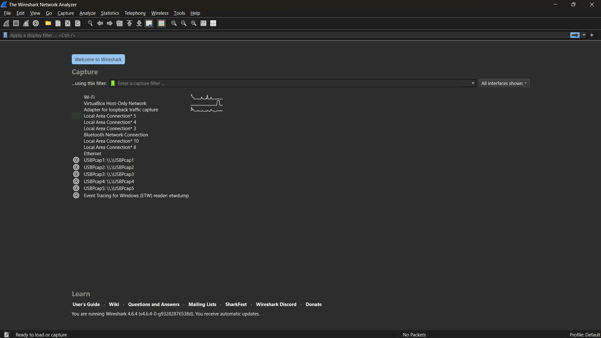
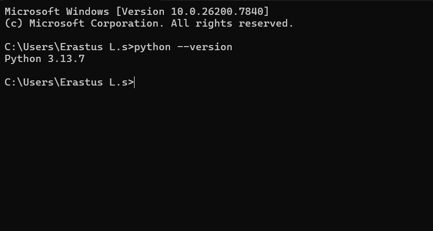

# Laporan Praktikum - Jaringan Komputer - Week 1

## Tujuan Praktikum
1. Mahasiswa mengetahui aturan dan sistem pelaksanaan praktikum  
2. Mahasiswa mengetahui tools yang akan digunakan dan memastikan tools berfungsi dengan baik selama pelaksanaan pratikum

## Alat yang digunakan
1. Wireshark
   
   Wireshark dapat di download pada link berikut ini: https://www.wireshark.org/download.html
3. Python
   
   Python dapat di download melalui link berikut ini: https://www.python.org/downloads
