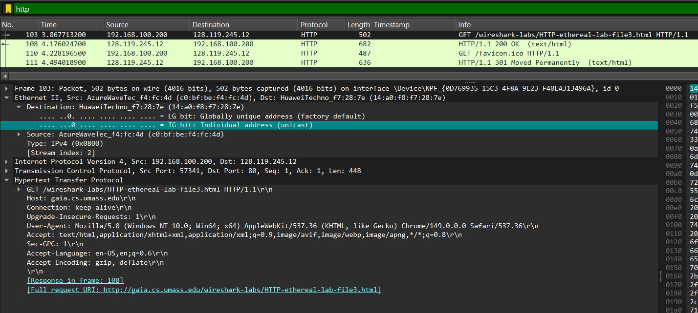
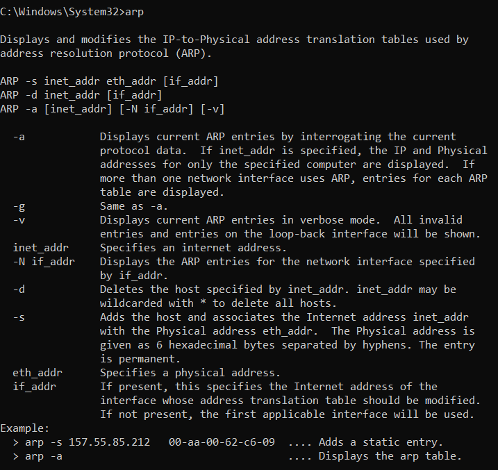
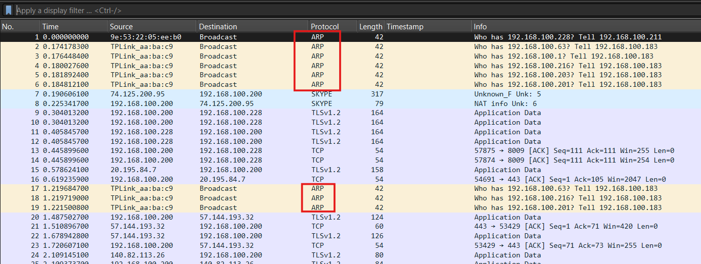

# Laporan Praktikum - Jaringan Komputer - Week 13
Modul 13: Ethernet and ARP

1. Menangkap dan menganalisis frame Ethernet
     
   * Gambar ini menampilkan paket HTTP GET di Wireshark. Di dalam praktikum, paket ini digunakan sebagai sampel untuk membedah isi Header Ethernet yang membungkus paket tersebut. Melalui analisis ini, mahasiswa dapat mengidentifikasi:
     * Source MAC Address: Alamat fisik kartu jaringan (NIC) komputer pengirim.
     * Destination MAC Address: Alamat fisik perangkat tujuan (biasanya merupakan alamat MAC dari Default Gateway / Router).
     * Type Field: Kolom yang menentukan protokol lapisan atas (biasanya bernilai 0x0800 yang menandakan protokol IPv4).
2. Caching ARP
     
    Gambar ini merepresentasikan tampilan Tabel ARP pada perangkat (yang diakses menggunakan perintah arp -a melalui Command Prompt atau Terminal). Di dalam tabel ini terdapat pemetaan baris demi baris antara Internet Address (Alamat IP) dengan Physical Address (Alamat MAC) yang berhasil didapatkan beserta tipenya (dynamic/static). Pada praktikum, biasanya praktikan diminta menghapus cache ini terlebih dahulu (arp -d) untuk memaksa komputer melakukan kembali proses "Aksi ARP" sebelum mengirimkan data.
4. Mengamati Aksi ARP
     
   Gambar ini menunjukkan visualisasi atau log paket protokol ARP di Wireshark yang menggambarkan dua langkah interaksi utama:
   * ARP Request (Broadcast): Komputer pengirim menyebarkan paket ke seluruh jaringan lokal dengan alamat tujuan ff:ff:ff:ff:ff:ff untuk bertanya: "Siapa pemilik alamat IP X? Tolong beri tahu saya."
   * ARP Reply (Unicast): Perangkat yang memiliki IP X tersebut akan menjawab secara langsung (unicast) ke komputer pengirim: "Saya pemilik IP X, dan ini alamat MAC saya."

### Rangkuman Alur Hubungan Materi & Gambar:
Ketika Anda menjalankan aplikasi jaringan (menghasilkan paket HTTP GET), komputer akan memeriksa tabel ARP Cache (Caching_ARP.png). Jika alamat MAC dari gateway/tujuan belum ada di tabel tersebut, pengiriman paket HTTP GET akan ditunda sementara waktu. Komputer akan melakukan Aksi ARP (Aksi_ARP.png) berupa Request dan Reply untuk mendapatkan alamat MAC tujuan. Setelah alamat MAC diperoleh dan dicatat di dalam tabel cache, barulah paket HTTP GET tersebut dibungkus ke dalam frame Ethernet dengan alamat MAC yang sesuai dan dikirimkan ke jaringan.
