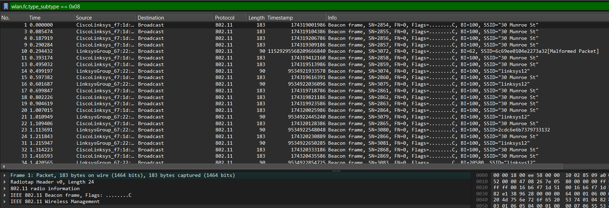
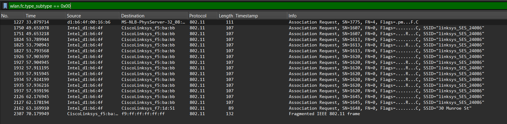
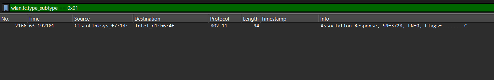
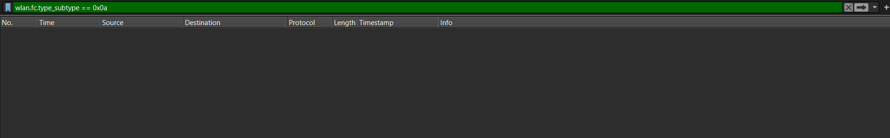

# Laporan Praktikum - Jaringan Komputer - Week 14
Modul 14: 802.11 WiFi

1. Beacon Frame
     
    Beacon Frame adalah bingkai manajemen yang dikirimkan secara berkala oleh Access Point (AP) untuk mengiklankan keberadaannya (advertise its existence) kepada perangkat-perangkat nirkabel di sekitarnya.
    * Analisis Karakteristik Wireshark:
      * Tipe & Subtipe: Termasuk dalam kelompok Management Frame (Type 0) dengan nilai Subtype 8 (0x08).
      * Arah Pengiriman: Dikirim secara broadcast oleh AP ke semua stasiun/host dalam jangkauan sinyalnya.
      * Informasi Penting di Dalamnya: Frame ini membawa parameter penting jaringan seperti SSID (nama WiFi, contoh di modul: 30 Munroe St), interval waktu pancaran suar (Beacon Interval), laju data yang didukung (Supported Rates), serta skema enkripsi/keamanan nirkabel yang digunakan.
   
2. Association Request
     
   Association Request adalah bingkai yang diinisiasi oleh host/klien nirkabel ketika ingin bergabung dan mengaitkan dirinya ke suatu jaringan Access Point setelah proses pemindaian (scanning) selesai.
   * Analisis Karakteristik Wireshark:
     * Tipe & Subtipe: Termasuk dalam Management Frame (Type 0) dengan nilai Subtype 0 (0x00).
     * Arah Pengiriman: Dikirim secara unicast dari alamat MAC (Source Address) host nirkabel menuju alamat MAC (Destination Address) AP target.
     * Informasi Penting di Dalamnya: Host mengirimkan informasi kapabilitas dirinya kepada AP, termasuk SSID spesifik yang dituju serta laju data (Supported Rates) yang mampu ditangani oleh kartu jaringan (network interface card) milik host tersebut
   
5. Association Response
     
   Association Response merupakan bingkai tanggapan yang dikirim balik oleh Access Point (AP) kepada host nirkabel sebagai jawaban atas permintaan Association Request yang diterima sebelumnya.
   * Analisis Karakteristik Wireshark:
     * Tipe & Subtipe: Termasuk dalam Management Frame (Type 0) dengan nilai Subtype 1 (0x01).
     * Arah Pengiriman: Dikirim secara unicast dari AP menuju host nirkabel yang mengajukan permohonan gabung.
     * Informasi Penting di Dalamnya: Frame ini memuat status apakah permintaan asosiasi tersebut diterima (Successful) atau ditolak. Jika berstatus sukses, AP akan memberikan Association ID (AID) yang berfungsi sebagai identitas unik bagi host tersebut selama terhubung di jaringan nirkabel terkait.
   
7. Disassociation
     
   Disassociation Frame digunakan untuk memutuskan hubungan asosiasi yang sedang berjalan antara host nirkabel dengan Access Point. Pemutusan ini bersifat informatif dan tidak memerlukan konfirmasi balik dari pihak penerima.
   * Analisis Karakteristik Wireshark:
     * Tipe & Subtipe: Termasuk dalam Management Frame (Type 0) dengan nilai Subtype 10 (0x0a).
     * Arah Pengiriman: Dapat dikirim secara unicast oleh host ke AP (misalnya saat host ingin memutus koneksi karena berpindah tempat), atau dari AP ke host (misalnya saat AP sedang reboot atau mengalami kelebihan beban).
     * Hubungan dengan Skenario Modul: Berdasarkan kronologi di Sub-bab 14.2, frame ini muncul pada t = 49,58 saat host nirkabel memutuskan sambungan secara sengaja dari AP 30 Munroe St untuk mencoba beralih (roaming) ke AP lain bernama linksys_ses_24086. Frame ini juga memuat informasi Reason Code (kode alasan) yang menjelaskan mengapa hubungan nirkabel tersebut diakhiri.
### Ringkasan Alur Hubungan Antar Frame
Di dalam implementasi jaringan nirkabel 802.11, keempat frame ini bekerja dalam satu siklus hidup koneksi:
1. AP memancarkan Beacon secara berkala
2. Host mendengarkan pancaran tersebut lalu mengirim Association Request
3. AP memverifikasi lalu menjawab dengan Association Response
4. Hubungan nirkabel selesai atau diputus di kemudian hari menggunakan Disassociation.
