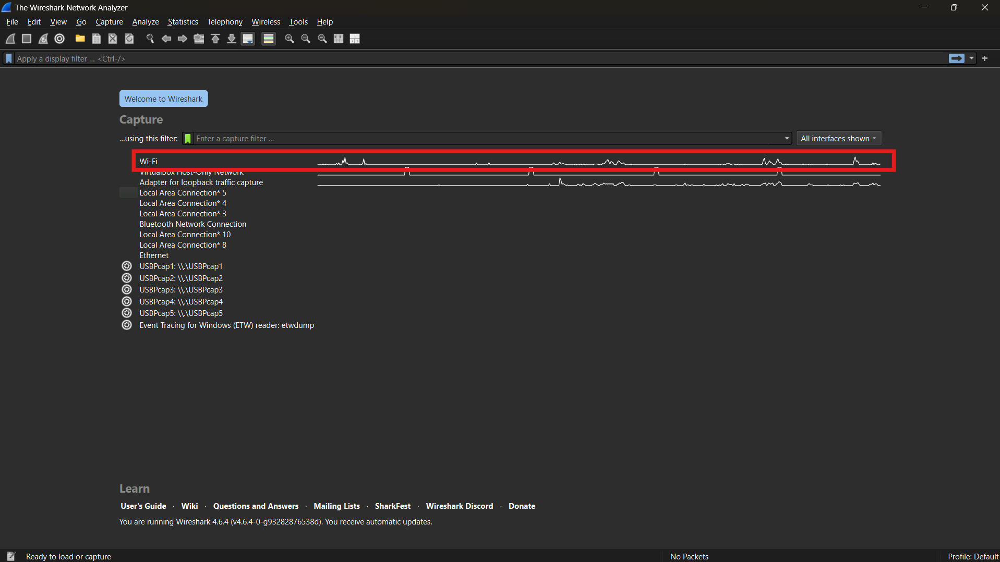
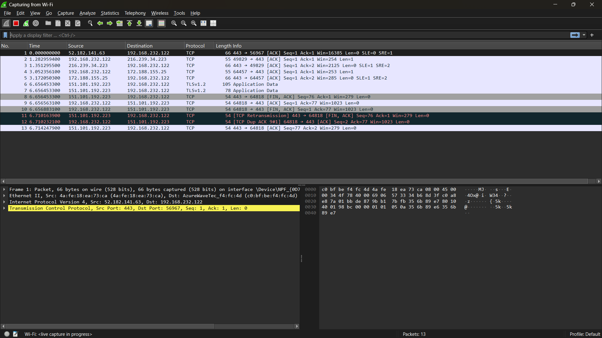
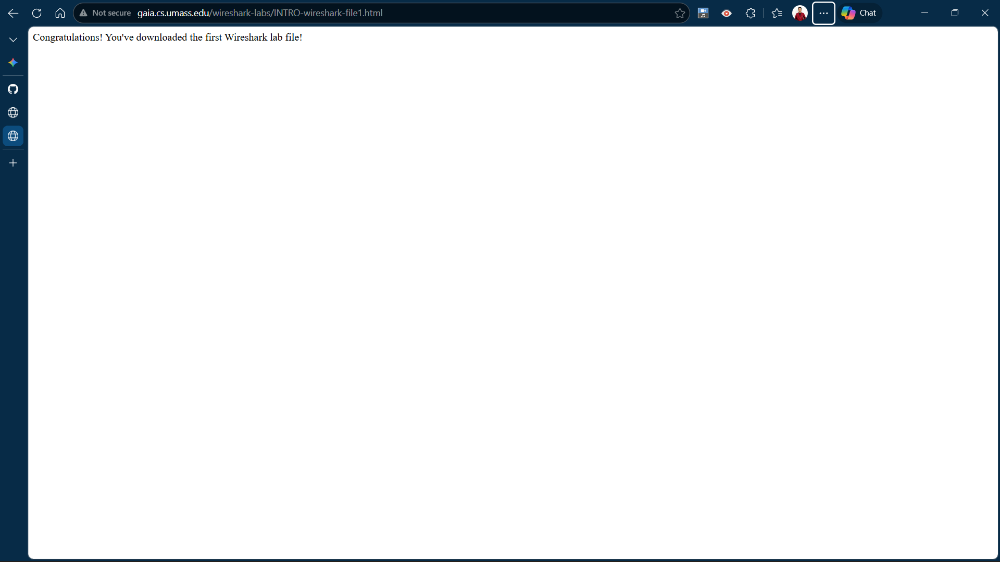
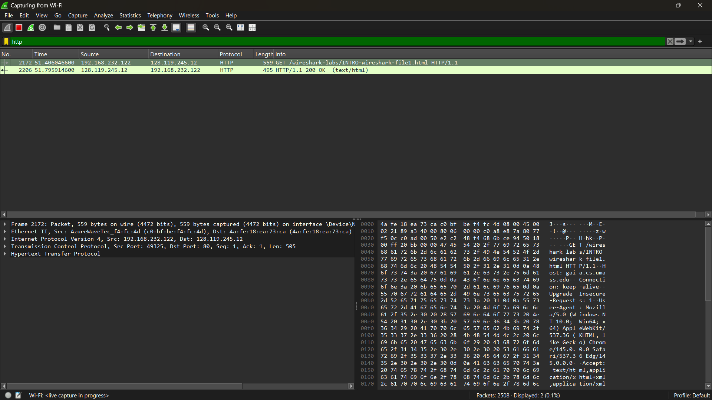

# Laporan Praktikum - Jaringan Komputer - Week 2

## Tujuan Praktikum
1. Mahasiswa dapat melakukan instalasi tool yang digunakan (Wireshark). 
2. Mahasiswa dapat menggunakan tool (Wireshark) untuk menangkap dan mengidentifikasi paket data 

## Alat yang digunakan
1. Wireshark

## Apa itu Wireshark?
Wireshark adalah penganalisis protokol jaringan bebas dan sumber terbuka. Wireshark memungkinkan pengguna untuk melihat lalu lintas yang sedang berjalan pada jaringan komputer. Wireshark dapat menangkap paket data dari berbagai jenis jaringan, termasuk Ethernet, Wi-Fi, dan Bluetooth. Wireshark juga dapat menangkap paket data dari berbagai jenis protokol, termasuk TCP, UDP, dan ICMP. Wireshark juga dapat menangkap paket data dari berbagai jenis aplikasi, termasuk HTTP, FTP, dan SMTP.

## Install Wireshark

## Praktikum
### 1. Buka aplikasi Wireshark dan Pilih interface yang akan digunakan
   
   karena kita menggunakan Wifi untuk terkoneksi ke jaringan maka, kita akan melakukan test run pada interface Wifi 

### 2. Buka interface wifi untuk melakukan capturing 
   
   Setelah membuka interface Wifi maka akan muncul beberapa panel yaitu packet list, packet details, dan packet Byte
   
### 3. Saat Wireshark sedang berjalan, masukkan URL: http://gaia.cs.umass.edu/wiresharklabs/INTRO-wireshark-file1.html
   
   Membuka link tersebut akan membuat browser user menghubungi server http di gaia.cs.umass.edu dan bertukar pesan HTTP dengan server untuk mendownload halaman ini.
   
### 4. Lakukan Filtering untuk protokol http
   
   Dengan memberikan filter protokol http maka Wireshark akan menyaring transaksi data yang menggunakan protokol http, yang mana pada langkah sebelumnya kita membuka website yang menggunakan protokol tersebut. jika prosedur ini berhasil maka akan muncul info "GET" diikuti oleh URL gaia.cs.umass.edu yang telah dibuka sebelumnya. 

## Kesimpulan
Pada prktikum ini kita belajar bagaimana cara kerja Wireshark dalam melakukan paket snifing dan bagaimana cara menggunakannya. Dari sini saya menyadari betapa pentingannya pengamanan data agar tidak dapat disalah gunakan oleh pihak yang tak bertanggung jawab.
