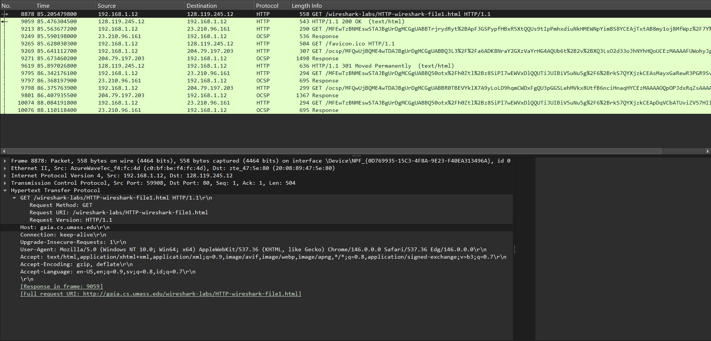
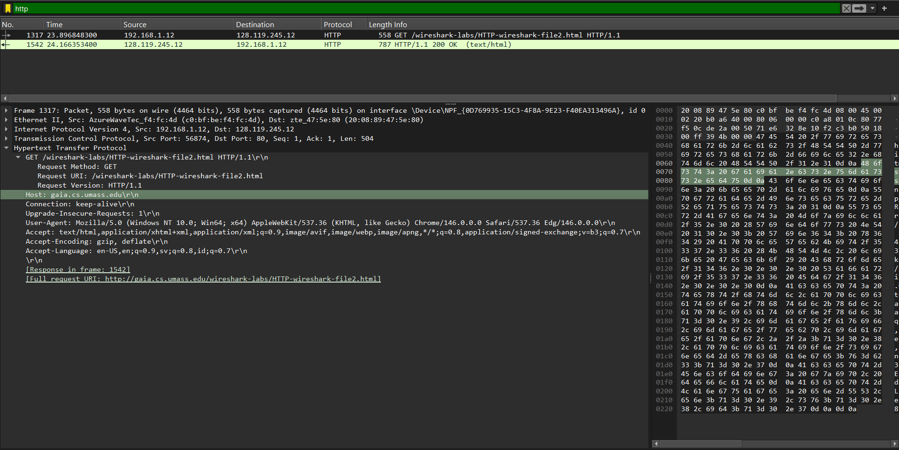
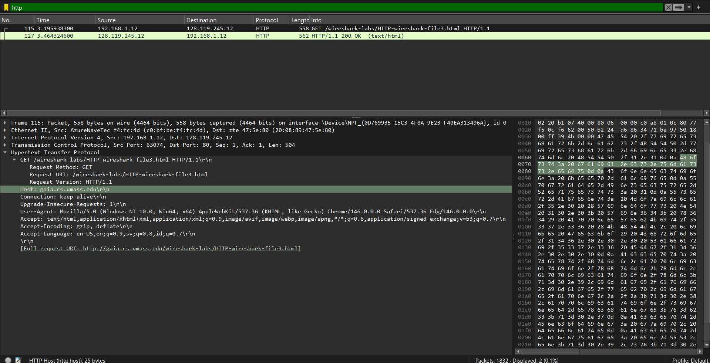
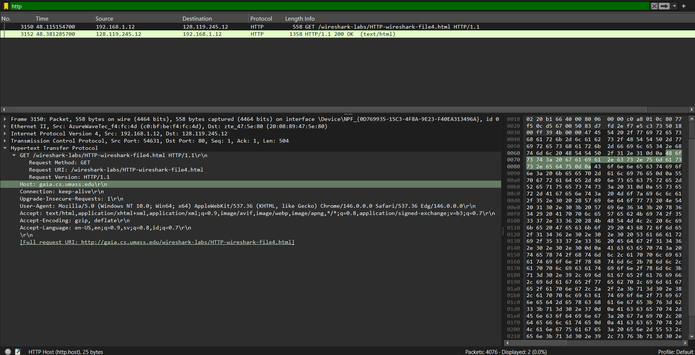
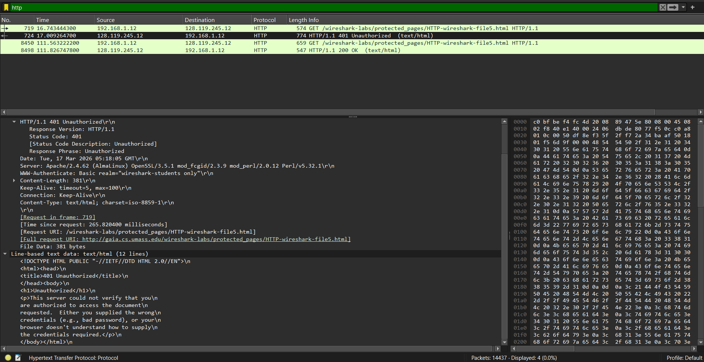

# Laporan Praktikum - Jaringan Komputer - Week 3
Modul 3: HTML

## Alat & Bahan yang digunakan:
1. Wireshark
2. Browser (Edge)
3. Jaringan Internet

## Apa itu HTTP:
HTTP (Hypertext Transfer Protocol) adalah protokol komunikasi utama yang digunakan untuk mengirimkan dan menerima data di jaringan World Wide Web (WWW). Secara sederhana, HTTP adalah "aturan bahasa" yang memungkinkan web browser (seperti Chrome atau Firefox) dan web server (tempat website disimpan) untuk saling berkomunikasi.

---

## Tujuan Praktikum:
Mahasiswa dapat menganalisis cara kerja protokol HTTP menggunakan Wireshark, meliputi struktur pesan GET/Response, mekanisme Conditional GET, penanganan dokumen panjang, objek tersemat, dan proses autentikasi.

---

## 1. Analisis Hasil Praktikum

### 1.1. Interaksi Dasar HTTP GET/Response

Pada pengujian pertama, dilakukan pengambilan file `HTTP-wireshark-file1.html`.
* **Analisis Paket:**
    * Paket No. **8878** menunjukkan permintaan **GET** dari klien (`192.168.1.12`) ke server (`128.119.245.12`).
    * Paket No. **9059** menunjukkan respons **200 OK** dari server yang berisi data HTML.
* **Header Detail:** Terlihat penggunaan browser **Edge/Chrome** pada sistem operasi **Windows 10** melalui field `User-Agent`. Server tujuan berada di `gaia.cs.umass.edu`.

#### 1.1.2 HTTP Conditional GET

Pengujian ini bertujuan melihat bagaimana browser berinteraksi dengan cache.
* **Analisis Paket:** Browser melakukan permintaan ke `HTTP-wireshark-file2.html` (Paket No. **1317**).
* **Hasil:** Server memberikan respons **200 OK** (Paket No. **1542**). Dalam mekanisme ini, jika cache sudah ada, browser biasanya menyertakan header `If-Modified-Since` untuk menghemat bandwidth.

### 1.2. Pengambilan Dokumen Panjang

Percobaan ini menggunakan file `HTTP-wireshark-file3.html` yang memiliki konten lebih besar.
* **Analisis Paket:** Permintaan GET dikirim pada paket No. **115**.
* **Segmentasi TCP:** Meskipun pesan HTTP terlihat sebagai satu kesatuan, pada lapisan transport data ini dipecah menjadi beberapa segmen TCP karena ukurannya yang besar, lalu disusun kembali (*reassembled*) oleh Wireshark untuk ditampilkan sebagai satu respons HTTP 200 OK (Paket No. **127**).

### 1.3. HTML dengan Objek Tersemat

Pada file `HTTP-wireshark-file4.html`, halaman mengandung objek tambahan (seperti gambar).
* **Analisis Paket:** Permintaan GET utama pada paket No. **3150**.
* **Observasi:** Setelah menerima file HTML dasar (Paket No. **3152**), browser akan melakukan permintaan GET tambahan secara otomatis untuk setiap objek (gambar) yang direferensikan di dalam kode HTML tersebut.

### 1.4. Autentikasi HTTP

Pengujian pada file `HTTP-wireshark-file5.html` yang dilindungi kata sandi.
* **Tahap 1:** Browser mengirimkan GET (Paket No. **719**), namun server membalas dengan **401 Unauthorized** (Paket No. **724**). Di dalam header ini terdapat field `WWW-Authenticate: Basic`, yang memicu munculnya kotak dialog login pada browser.
* **Tahap 2:** Setelah kredensial dimasukkan, browser mengirimkan GET kembali (Paket No. **8450**) yang kini menyertakan header `Authorization: Basic`.
* **Tahap 3:** Server memverifikasi data dan akhirnya memberikan akses dengan respons **200 OK** (Paket No. **8498**).

---

## Kesimpulan
Berdasarkan praktikum ini, dapat disimpulkan bahwa:
1. HTTP bekerja berdasarkan model *request-response* di atas protokol TCP (Port 80).
2. Mekanisme *Conditional GET* dan *Caching* sangat penting untuk efisiensi jaringan.
3. Objek tersemat dalam HTML membutuhkan transaksi HTTP terpisah untuk setiap objeknya.
4. Autentikasi dasar HTTP mengirimkan kredensial dalam bentuk teks terenkode (Base64) melalui header `Authorization`, yang menunjukkan bahwa metode ini kurang aman jika tidak dibarengi dengan HTTPS.

---
