# Laporan Praktikum - Jaringan Komputer - Week 4
Modul 4: DNS

## Alat & Bahan yang digunakan:
1. Wireshark
2. Browser (Edge)
3. Jaringan Internet
4. CMD

## 1. Nslookup
### 1.1. nslookup 
+ **Apa itu Nslookup?**
  + Nslookup atau Name Server Lookup adalah sebuah alat baris perintah (command-line tool) yang digunakan untuk mengetahui alamat IP dari sebuah nama domain (website) atau sebaliknya, dengan cara bertanya kepada server DNS (Domain Name System).   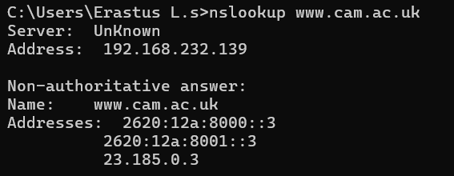   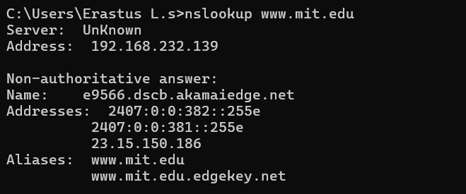 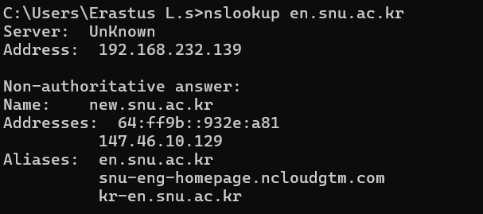
### 1.2. nslookup –type=NS
+ Perintah nslookup -type=NS digunakan untuk mencari tahu Server Nama (Name Server) resmi yang memegang kendali atas sebuah domain.   img src="Images/1.4.png">
### 1.3. _nslookup –option1 –option2 host-to-find dns-server_   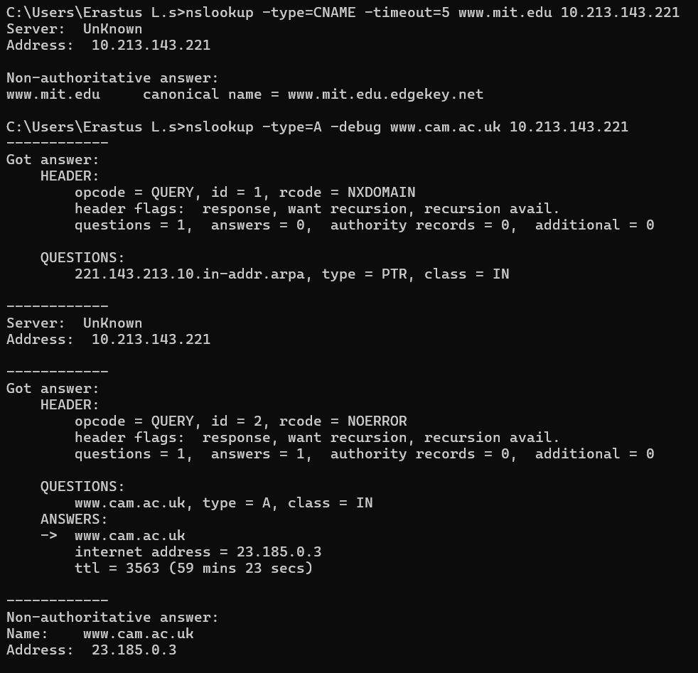
## 2. Ipconfig
+ Ipconfig **(Internet Protocol Configuration)** adalah sebuah perintah dasar pada sistem operasi Windows yang digunakan untuk melihat, menampilkan, dan mengatur informasi konfigurasi jaringan (TCP/IP) pada komputer.
### 2.1. _ipconfig \all_
+ ipconfig /all akan membongkar seluruh informasi konfigurasi jaringan (TCP/IP) dari semua kartu jaringan (adapter WiFi, LAN/Ethernet, hingga virtual adapter) yang ada di komputer.   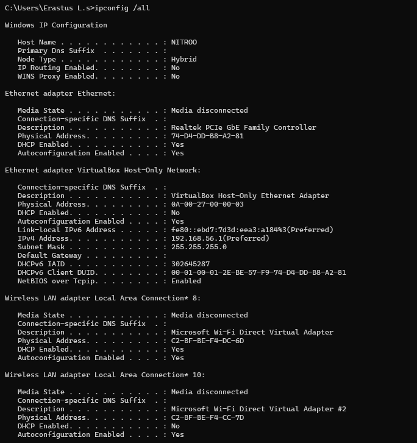
### 2.2. _ipconfig /displaydns_
+ ipconfig /displaydns adalah perintah pada Windows yang digunakan untuk melihat isi dari DNS Cache (ingatan sementara DNS) di komputer.   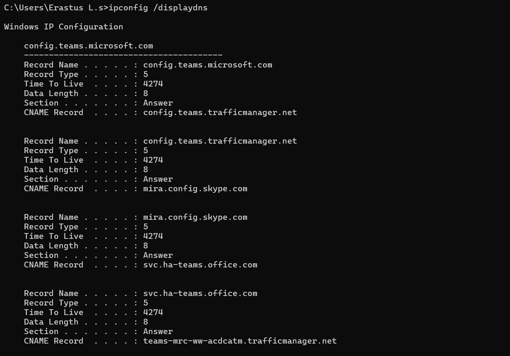
### 2.3. _ipconfig /flushdns_
+ ipconfig /flushdns adalah perintah pada Windows yang berfungsi untuk menghapus dan mengosongkan DNS Cache (ingatan sementara tentang alamat IP website) di komputer.   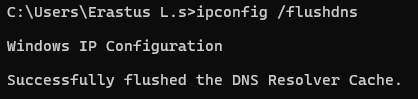

## 3. Tracing DNS dengan Wireshark I
### 1. Cari pesan permintaan DNS dan balasannya. Apakah pesan tersebut dikirimkan melalui UDP atau TCP? 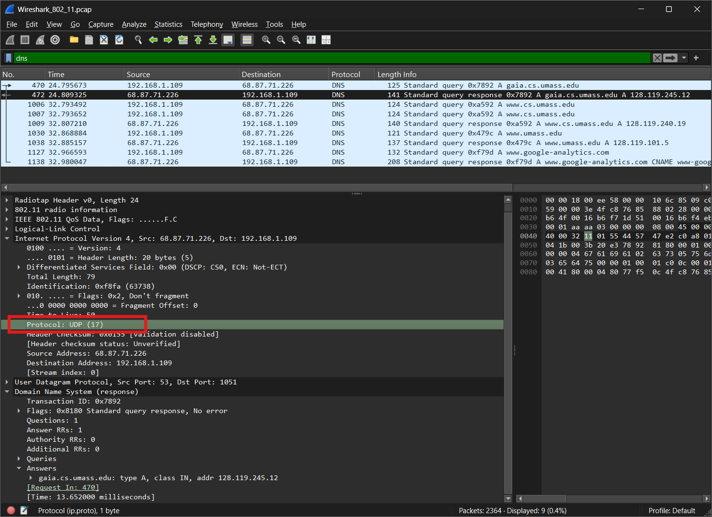
+ Pesan dikirim menggunakan protokol **UDP**
### 2. Apa port tujuan pada pesan permintaan DNS? Apa port sumber pada pesan balasannya?   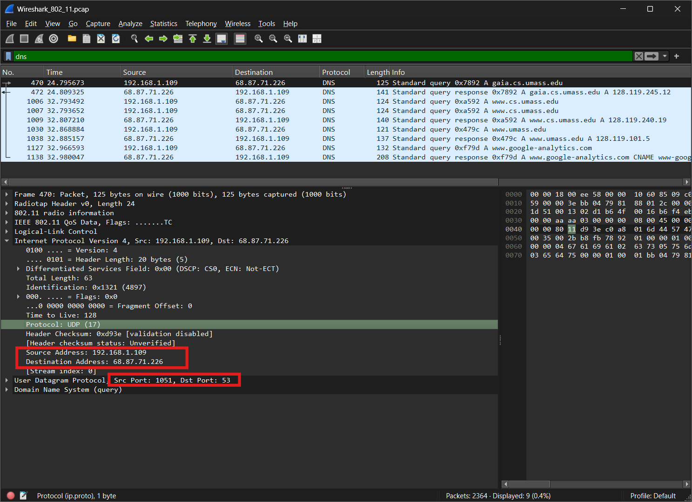
+ Port tujuan = 53 
+ Port sumber = 1051
### 3. Pada pesan permintaan DNS, apa alamat IP tujuannya? Apa alamat IP server DNS lokal anda? Apakah kedua alamat IP tersebut sama?   
+ Berbeda
+ Alamat IP Tujuan: 68.87.71.226
+ Alamat IP DNS Lokal: 10.213.143.221
### 4. Periksa pesan permintaan DNS. Apa “jenis” atau ”type” dari pesan tersebut? Apakah pesan permintaan tersebut mengandung ”jawaban” atau ”answers”?   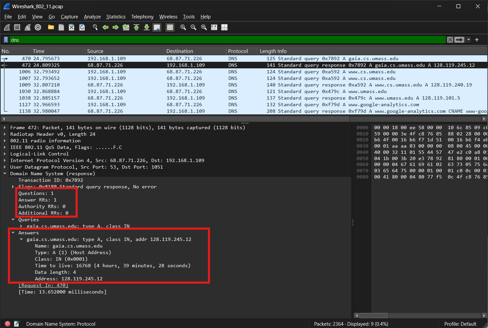
+ type: A
+ Pesan tersebut mengandung balasan.   **Bukti:** "**Answer RRs: 1**"
### 5. Periksa pesan balasan DNS. Berapa banyak ”jawaban” atau ”answers” yang terdapat di dalamnya? Apa saja isi yang terkandung dalam setiap jawaban tersebut?   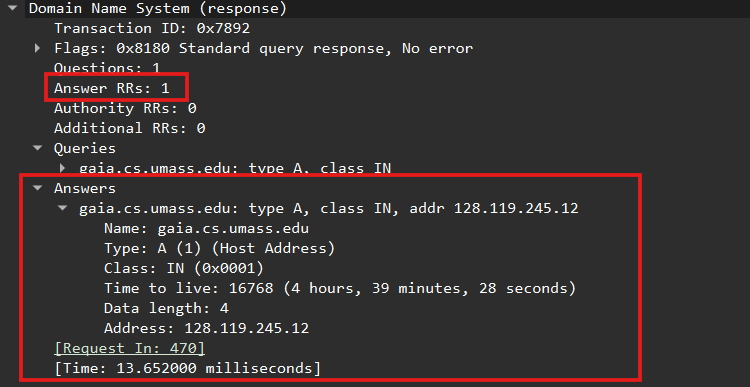
### 6. Perhatikan paket TCP SYN yang selanjutnya dikirimkan oleh host Anda. Apakah alamat IP pada paket tersebut sesuai dengan alamat IP yang tertera pada pesan balasan DNS?   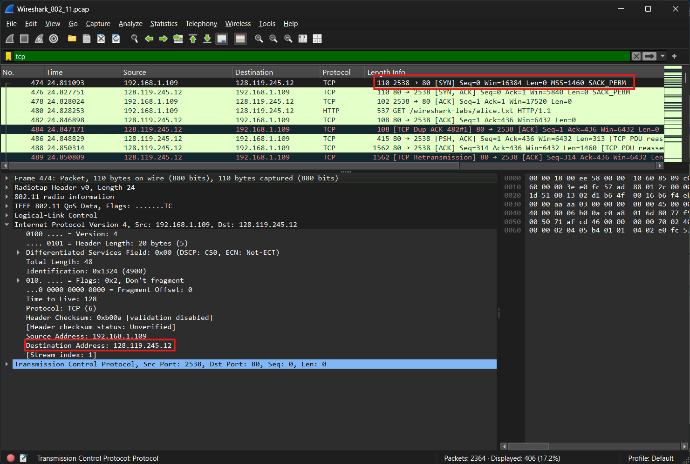
+ Sesuai, karena alamat IP **128.119.245.12** sama dengan alamat IP yang diberikan pad respon DNS
### 7. Cari pesan permintaan DNS dan balasannya. Apakah pesan tersebut dikirimkan melalui UDP atau TCP?Halaman web yang sebelumnya anda akses (http://www.ietf.org) memuat beberapa gambar. Apakah host Anda perlu mengirimkan pesan permintaan DNS baru setiap kali ingin mengakses suatu gambar?
+ tidak, karena alamat IP sudah tersimpan di cache, dan bisa digunakan terus menerus selama cache tidak dibersihkan. 

## 4. Tracing DNS dengan Wireshark II (nslookup mit.edu)   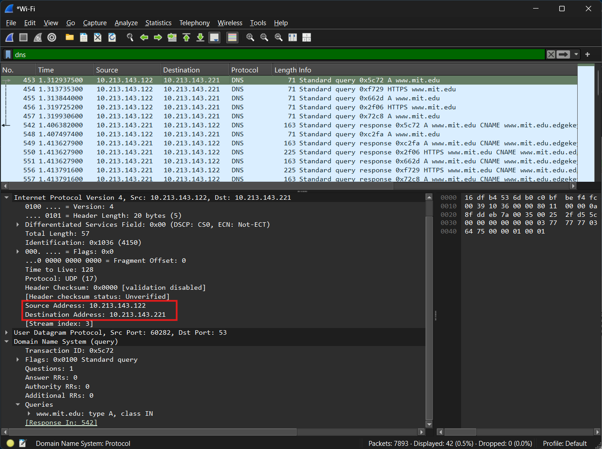
1. Apa port tujuan pada pesan permintaan DNS? Apa port sumber pada pesan balasan DNS?   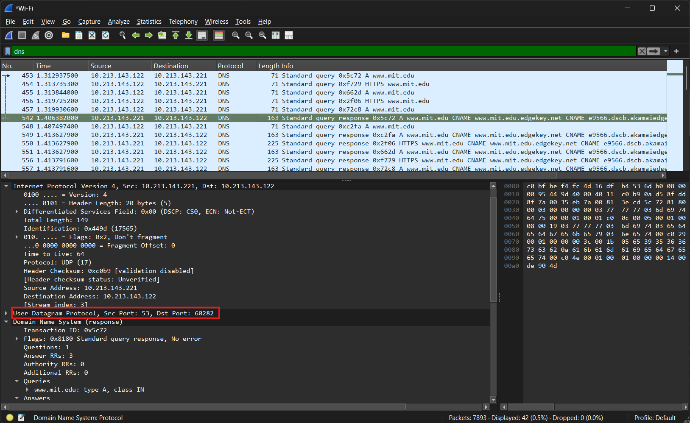
   + Sama
   + Port tujuan (request): 53
   + Port destinasi (respons): 53
2. Ke alamat IP manakah pesan permintaan DNS dikirimkan? Apakah alamat IP tersebut merupakan default alamat IP server DNS lokal Anda?   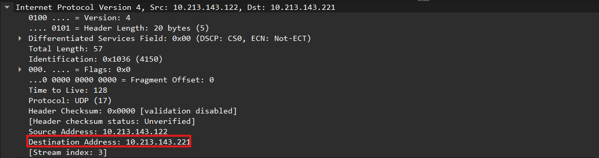   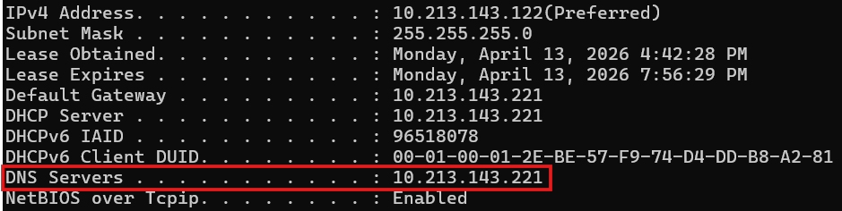
   + **Sama dengan DNS Lokal**. 
3. Periksa pesan permintaan DNS. Apa ”jenis” atau ”type” dari pesan tersebut? Apakah pesan tersebut mengandung ”jawaban” atau ”answers”?   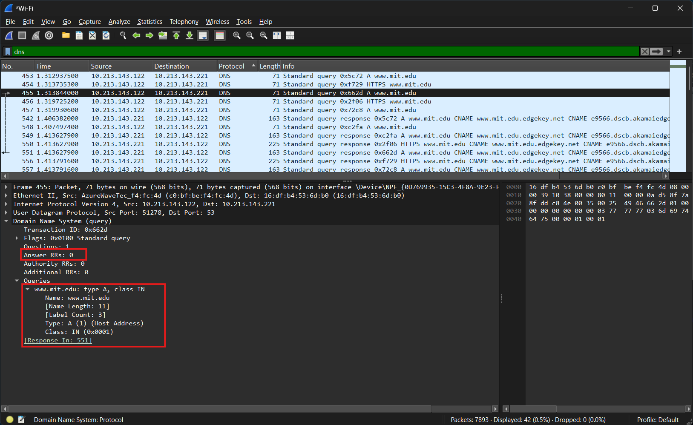
   + Type: A
   + Answer: 0 (Tidak ada)
4. Periksa pesan balasan DNS. Berapa banyak ”jawaban” atau “answers” yang terdapat di dalamnya. Apa saja isi yang terkandung dalam setiap jawaban tersebut?
   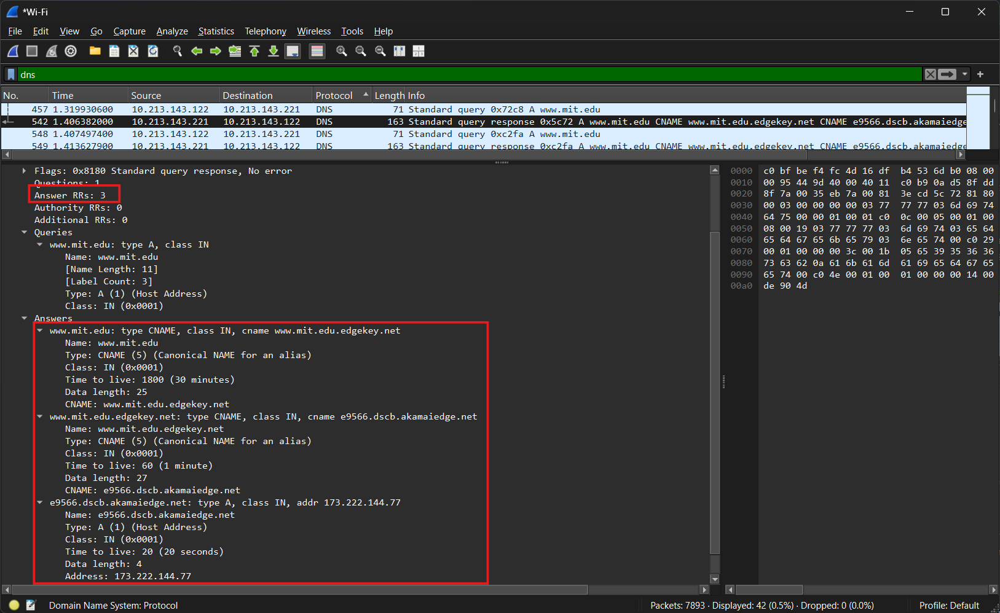
   + Answer: 3
   + Type I: CNAME
     + Name: www.mit.edu
     + TTL: 30 menit
     + Data length: 25
   + Type II: CNAME
     + Name: www.mit.edu.edgekey.net
     + TTL: 1 menit
     + Data length: 27
   + Type III: A
     + Name: e9566.dscb.akamaiedge.net
     + TTL: 20 detik
     + Data length: 4
     + Addr: 173.222.144.77

## 5. Tracing DNS dengan Wireshark III (nslookup -type=NS mit.edu)
1. Ke alamat IP manakah pesan permintaan DNS dikirimkan? Apakah alamat IP tersebut merupakan default alamat IP server DNS lokal Anda?
   + IP tersebut merupakan alamat IP server DNS lokal saya   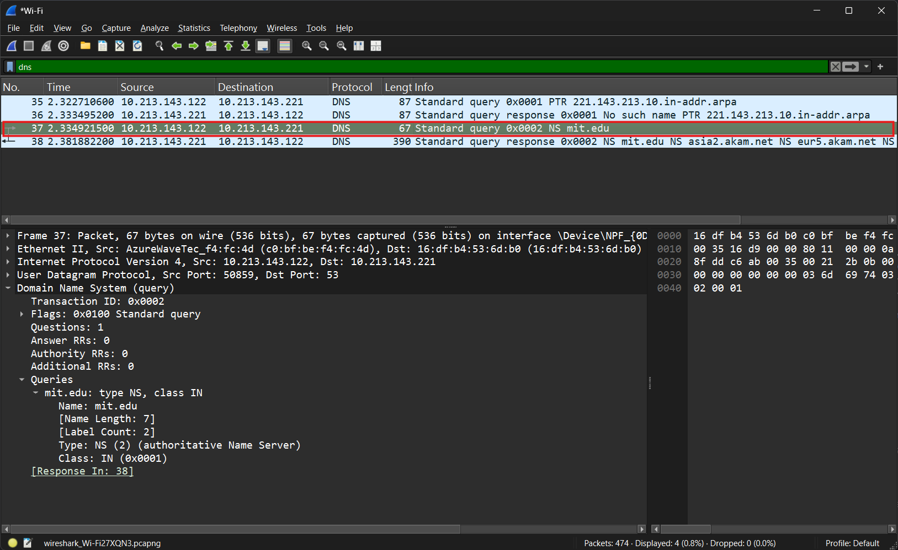
2. Periksa pesan permintaan DNS. Apa ”jenis” atau ”type” dari pesan tersebut? Apakah pesan tersebut mengandung ”jawaban” atau ”answers”?
   + Type: NS, namun pesan tersebut tidak mengandung answare (0)   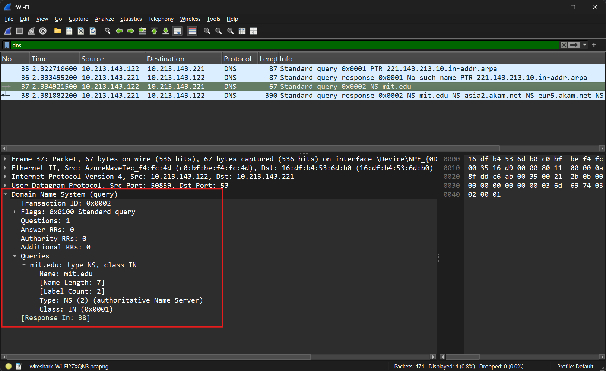
3. Periksa pesan balasan DNS. Apa nama server MIT yang diberikan oleh pesan balasan? Apakah pesan balasan ini juga memberikan alamat IP untuk server MIT tersebut?
   + Iya, ada banyak nama server yang diberikan beserta IP-nya, di antaranya ada asia2.akam.net (IP: 95.101.36.64), eur5.akam.net (IP: 23.74.25.64), use5.akam.net (IP: 2.16.40.64) dan masih ada server lainnya ddengan setiap server memiliki IP nya masing-masing.   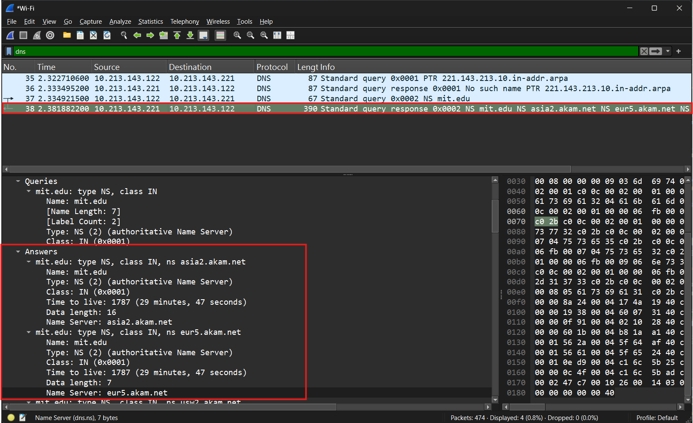

## 6. Tracing DNS dengan Wireshark IV (nslookup www.aiit.or.kr 8.8.8.8)
+ **dikarenakan akses saya diblokir oleh MIT maka saya akan menggunakan server publik milik Google (8.8.8.8).**
1. Ke alamat IP manakah pesan permintaan DNS dikirimkan? Apakah alamat IP tersebut merupakan default alamat IP server DNS lokal Anda?
   + Pesan permintaan dikirim ke 8.8.8.8 (Google), alamt tersebut berbeda dengan DNS lokal saya.   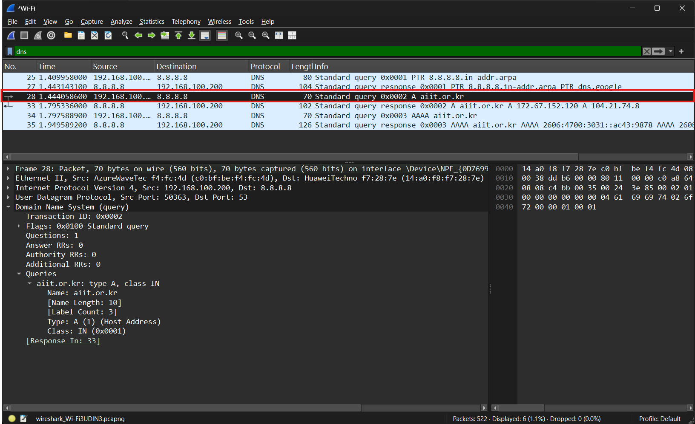 
2. Periksa pesan permintaan DNS. Apa ”jenis” atau ”type” dari pesan tersebut? Apakah pesan tersebut mengandung ”jawaban” atau ”answers”? 
   + Type: A, dan pesan tersebut tidak memiliki jawaban (0)   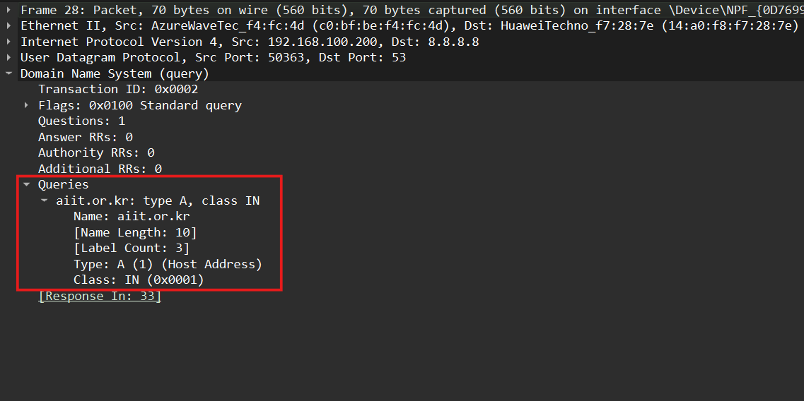
3. Periksa pesan balasan DNS. Berapa banyak ”jawaban” atau “answers” yang terdapat di dalamnya. Apa saja isi yang terkandung dalam setiap jawaban tersebut?
   + Terdapat 2 answare yaitu:   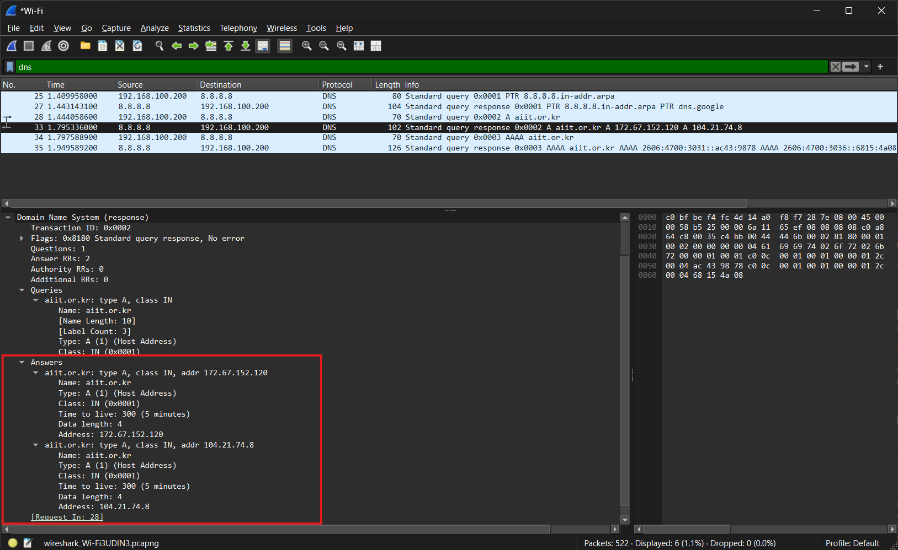
     + Answare I:
       + Name: aiit.or.kr
       + Type: A (1) (Host Address)
       + TTL: 5 menit
       + Data length: 4
       + Addr: 172.67.152.120
     + Answare II:
       + Name: aiit.or.kr
       + Type: A (1) (Host Address)
       + TTL: 5 menit
       + Data length: 4
       + Addr: 104.67.152.120