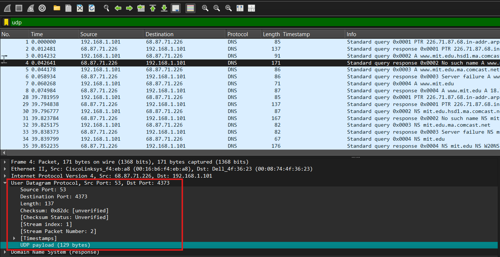
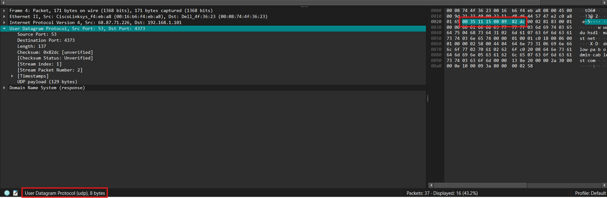
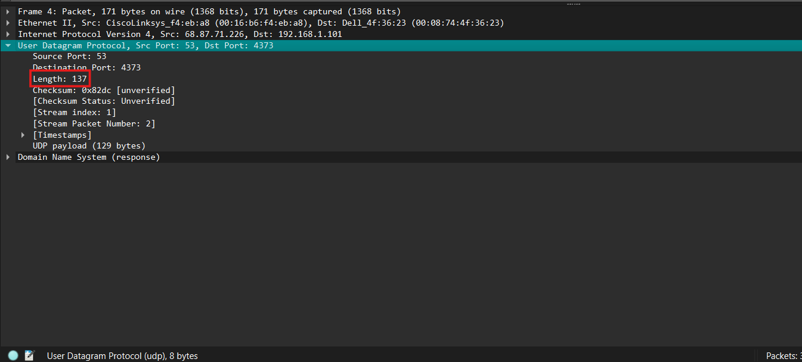
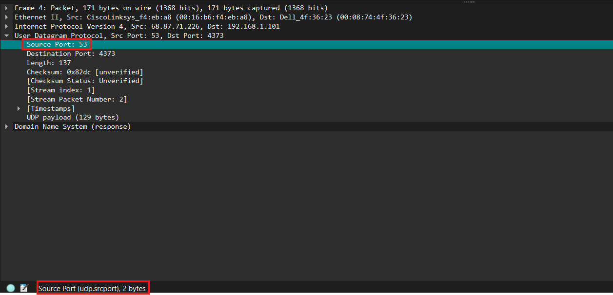
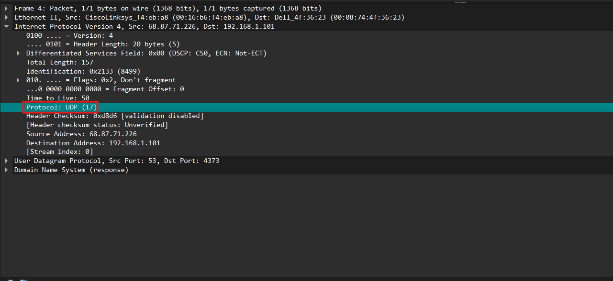
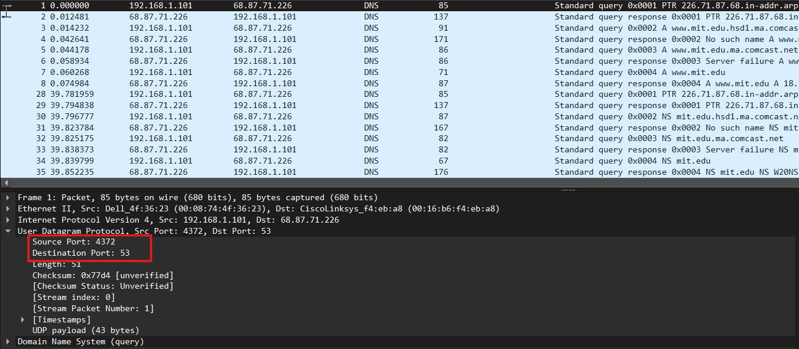
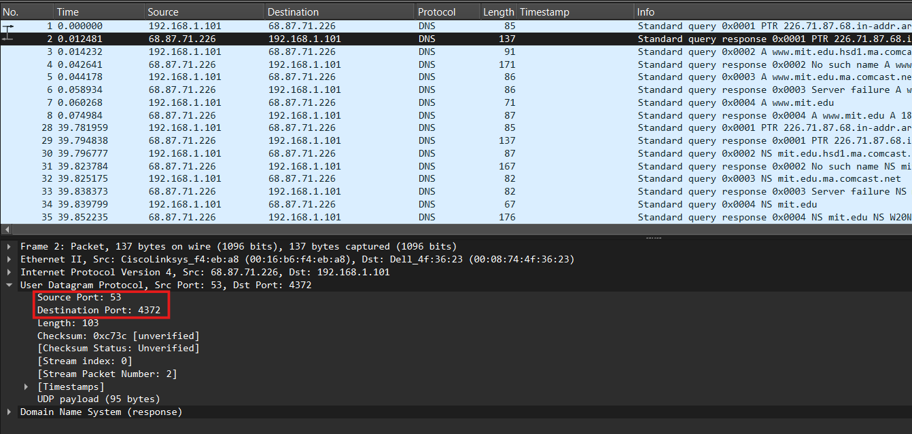

# Laporan Praktikum - Jaringan Komputer - Week 5
Modul 5: UDP

1. Pilih satu paket UDP yang terdapat pada trace Anda. Dari paket tersebut, berapa banyak “field” yang terdapat pada header UDP? Sebutkan nama-nama field yang Anda temukan!
     
   Jumlah field pada header UDP = 4 field, yaitu:
   * Source Port
   * Destination Port
   * Length
   * Checksum
2. Perhatikan informasi “content field” pada paket yang Anda pilih di pertanyaan 1. Berapa panjang (dalam satuan byte) masing-masing “field” yang terdapat pada header UDP?
     
   Panjang masing-masing field pada header UDP:
   * Source Port = 2 byte
   * Destination Port = 2 byte
   * Length = 2 byte
   * Checksum = 2 byte
   * Total header UDP = 8 byte
3. Nilai yang tertera pada ”Length” menyatakan nilai apa? Verfikasi jawaban Anda melalui paket UDP pada trace.
     
   * Length = 137 bytes
   * Header UDP = 8 bytes
   * UDP Payload  = 129 bytes
   * UDP Segment (header + payload) = 137 bytes
   
4. Berapa jumlah maksimum byte yang dapat disertakan dalam payload UDP?
     
   field **Length** pada header UDP berukuran 2 byte, sehingga nilai maksimum nya adalah 65535 byte.
   Nilai ini menyatakan total panjang segmen UDP, yaitu header + payload. Karena panjang header UDP selalu 8 byte, maka ukuran maksimum payload UDP adalah:
   * **65535 - 8 = 65527 byte**
   
5. Berapa nomor port terbesar yang dapat menjadi port sumber?
     
   * Nomor port sumber terbesar adalah 65535.
   * Karena field **Source Port** berukuran **2 byte (16 bit)**, maka nilai maksimum yang dapat direpresentasikan adalah:
   2¹⁶ − 1 = 65535
6. Berapa nomor protokol untuk UDP? Berikan jawaban Anda dalam notasi heksadesimal dan desimal. Untuk menjawab pertanyaan ini, Anda harus melihat ke bagian ”Protocol” pada datagram IP yang mengandung segmen UDP.
     
   * Desimal = 17
   * Hexadesimal = 0x11
11. Periksa pasangan paket UDP di mana host Anda mengirimkan paket UDP pertama dan paket UDP kedua merupakan balasan dari paket UDP yang pertama.
    * Host   
        Source Port = 4372
        Destination Port = 53
    * Respons   
        Source Port = 53
        Destination Port = 4371
    * Hubungan
        Source Port paket Host = Destination Port paket Respon
        Destination Port paket Host = Source Port paket Respon
