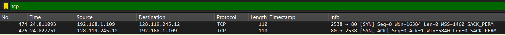
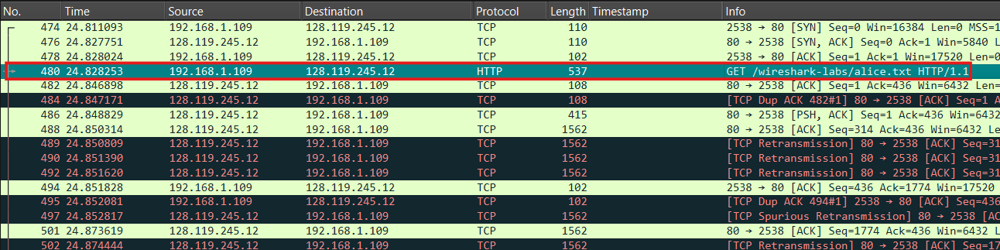
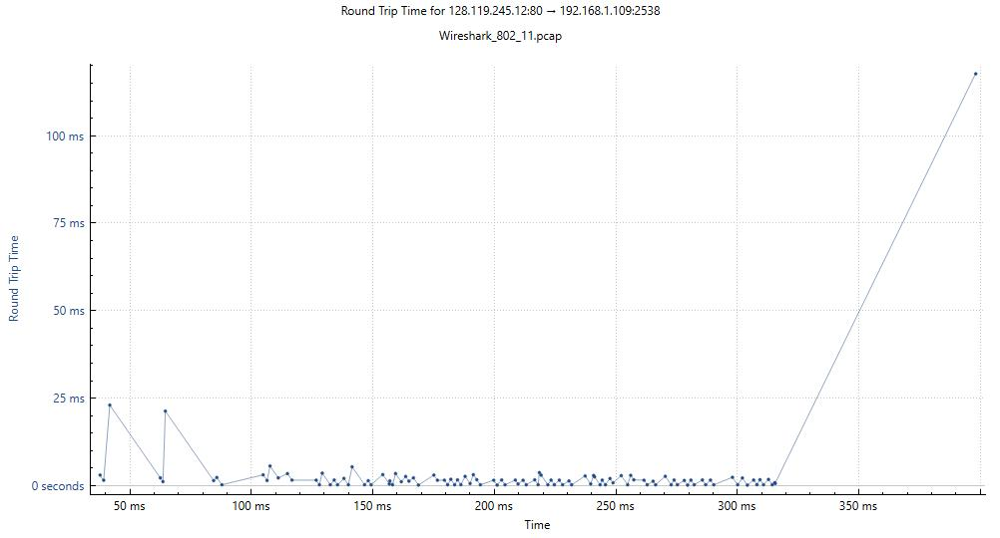
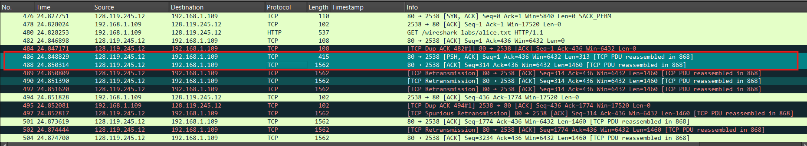
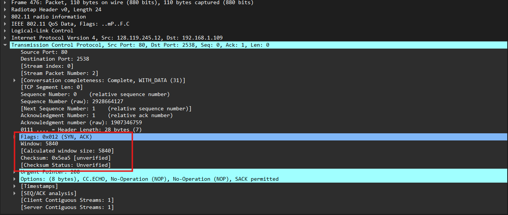
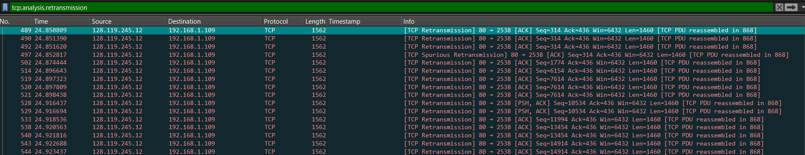
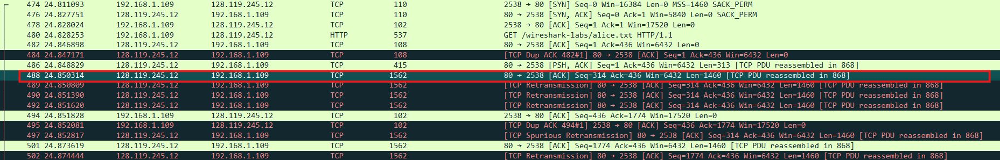
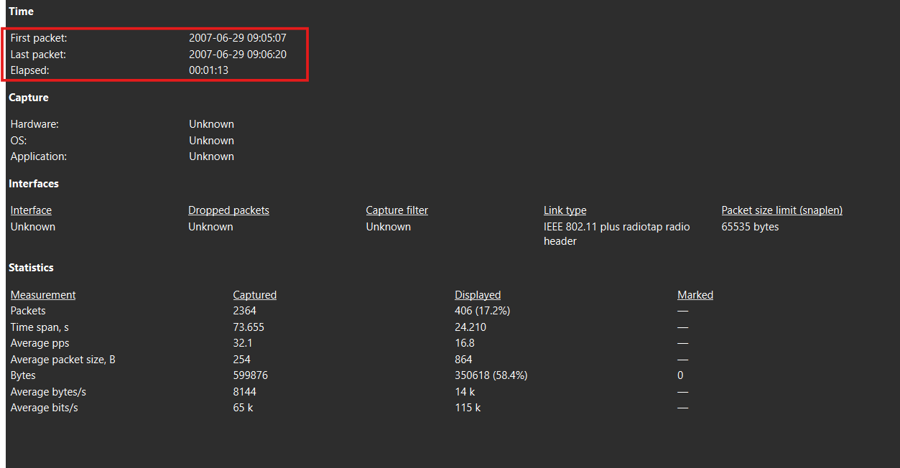

# Laporan Praktikum - Jaringan Komputer - Week 6
Modul 6: TCP

## 1. Berapa nomor urut segmen TCP SYN yang digunakan untuk memulai sambungan TCP antara komputer klien dan gaia.cs.umass.edu? Apa yang dimiliki segmen tersebut sehingga teridentifikasi sebagai segmen SYN?
  
* **Nomor Urut (Sequence Number):** Nomor urut relatif yang digunakan adalah 0 (Seq=0). Di dalam file data capture, paket ini berada pada nomor paket (No.) 474.
* **Karakteristik Identifikasi:** Segmen ini teridentifikasi sebagai segmen SYN karena pada field Flags di header TCP, bit SYN (Synchronize) diatur bernilai 1 (Set), sedangkan bit kontrol lainnya bernilai 0. Selain itu, panjang data segmen ini adalah nol (Len=0) karena hanya digunakan untuk inisialisasi koneksi.
---

## 2. Berapa nomor urut segmen SYNACK yang dikirim oleh gaia.cs.umass.edu ke komputer klien sebagai balasan dari SYN? Berapa nilai dari field Acknowledgement pada segmen SYNACK? Bagaimana gaia.cs.umass.edu menentukan nilai tersebut? Apa yang dimiliki oleh segmen sehingga teridentifikasi sebagai segmen SYNACK?
  
* **Nomor Urut & Nilai Acknowledgement:** Nomor urut relatif (Sequence Number) dari segmen SYNACK yang dikirim oleh server gaia.cs.umass.edu adalah 0 (Seq=0), dan nilai field Acknowledgement (Ack) adalah 1 (Ack=1). Paket ini berada pada nomor paket 476.
* **Penentuan Nilai Acknowledgement oleh Server:** Server gaia.cs.umass.edu menentukan nilai tersebut dengan mengambil nomor urut awal (ISN) dari segmen SYN klien (yaitu 0), lalu menambahkannya dengan 1. 
  * Perhitungan: Ack = 0 + 1 = 1
  * Penambahan ini berfungsi sebagai tanda bahwa server berhasil menerima segmen SYN dan mengharapkan bait data pertama klien dimulai dari nomor urut 1.
* **Karakteristik Identifikasi:** Segmen ini teridentifikasi sebagai SYNACK karena memiliki dua bit kontrol yang aktif bersamaan pada field Flags, yaitu bit SYN bernilai 1 dan bit ACK bernilai 1 ([SYN, ACK]).
---

## 3. Berapa nomor urut segmen TCP yang berisi perintah HTTP POST? Perhatikan bahwa untuk menemukan perintah POST, Anda harus menelusuri content field milik paket di bagian bawah jendela
  
* **Nomor Urut Segmen Perintah:** Berdasarkan data nyata yang terekam pada berkas ini, komputer klien tidak mengirimkan perintah POST, melainkan perintah HTTP GET untuk mengunduh dokumen teks alice.txt. Nomor urut relatif (Sequence Number) untuk segmen ini adalah 1 (Seq=1), yang berada pada paket No. 480.
* **Isi Field DATA:** Di bagian terbawah jendela Wireshark (field data dalam bentuk teks ASCII), segmen ini menunjukkan teks instruksi protokol: GET /wireshark-labs/alice.txt HTTP/1.1.
---

## 4. Perhitungan RTT dan EstimatedRTT
  
Sesuai dengan alur data pengunduhan berkas dari server gaia.cs.umass.edu (128.119.245.12) ke komputer klien, berikut adalah tabel runut waktu dari 6 segmen data pertama yang dikirimkan oleh server beserta estimasi nilai RTT-nya:

| No. Segmen | No. Paket | Seq. Number | Waktu Dikirim (s) | No. Paket ACK | Waktu ACK Diterima (s) | Sample RTT (ms) | EstimatedRTT (ms) |
| :---: | :---: | :---: | :---: | :---: | :---: | :---: | :---: |
| **1** | 486 | 1 | 24.848829 | 494 | 24.851828 | 3.00 | **3.00** *(Base)* |
| **2** | 488 | 314 | 24.850314 | 494 | 24.851828 | 1.51 | **2.81** |
| **3** | 501 | 1774 | 24.873619 | 509 | 24.875810 | 2.19 | **2.74** |
| **4** | 504 | 3234 | 24.874700 | 509 | 24.875810 | 1.11 | **2.53** |
| **5** | 507 | 4694 | 24.875690 | 517 | 24.896969 | 21.28 | **4.87** |
| **6** | 513 | 6154 | 24.895561 | 517 | 24.896969 | 1.41 | **4.44** |

*(Perhitungan menggunakan rumus standar konvensi EstimatedRTT.
---

## 5. Berapa panjang setiap enam segmen TCP pertama?
  
Panjang dari masing-masing 6 segmen TCP pertama di atas (tidak termasuk ukuran header IP/TCP) adalah sebagai berikut:
* Segmen 1 (Paket 486): 313 Byte (Len=313)
* Segmen 2 (Paket 488): 1460 Byte (Len=1460)
* Segmen 3 (Paket 501): 1460 Byte (Len=1460)
* Segmen 4 (Paket 504): 1460 Byte (Len=1460)
* Segmen 5 (Paket 507): 1460 Byte (Len=1460)
* Segmen 6 (Paket 513): 1460 Byte (Len=1460)
---

## 6. Berapa jumlah minimum ruang buffer tersedia yang disarankan kepada penerima dan diterima untuk seluruh trace? Apakah kurangnya ruang buffer penerima pernah menghambat pengiriman?
  
* **Jumlah Minimum Ruang Buffer:** Nilai minimum Receive Window Size yang diiklankan sepanjang perekaman trace ini adalah 5840 Byte, yang dikirim oleh pihak server pada saat inisialisasi awal paket SYNACK (Paket No. 476).
* **Apakah Menghambat Pengiriman?** Tidak, kurangnya ruang buffer penerima tidak pernah menghambat pengiriman. Nilai buffer terkecil sekalipun (5840 atau 6432 byte) masih jauh lebih besar daripada ukuran segmen data maksimum standar (1460 byte), sehingga jendela buffer penerima tidak pernah menyusut hingga mencapai angka 0 (Zero Window).
---

## 7. Apakah ada segmen yang ditransmisikan ulang dalam file trace? Apa yang anda periksa (di dalam file trace) untuk menjawab pertanyaan ini?
  
* **Apakah Ada Retransmisi?** Ya, ada. Di dalam berkas pelacakan ini terdapat gangguan transmisi yang menyebabkan cukup banyak paket harus dikirim ulang (tercatat total sebanyak 65 paket retransmisi).
* **Apa yang Diperiksa?** Untuk mengetahuinya, kita memeriksa kolom Info di Wireshark dan mencari label penanda otomatis berwarna hitam/merah yang bertuliskan [TCP Retransmission] atau [TCP Fast Retransmission]. Contohnya dapat dilihat langsung pada Paket No. 489 dan No. 490.
---

## 8. Berapa banyak data yang biasanya diakui oleh penerima dalam ACK? Dapatkah anda mengidentifikasi kasus-kasus di mana penerima melakukan ACK untuk setiap segmen yang diterima?
  
* **Jumlah Data yang Diakui:** Penerima (klien) umumnya mengakui akumulasi data sebesar 2920 Byte dalam satu paket ACK tunggal. Hal ini dikarenakan TCP menggunakan mekanisme Delayed ACK (RFC 1122), di mana penerima tidak langsung mengirim ACK untuk setiap segmen tunggal, melainkan menunggu hingga menerima setidaknya 2 segmen penuh berukuran MSS (1460 * 2 = 2920 byte).
* **Kasus ACK untuk Setiap Segmen:** Kasus pengiriman ACK untuk setiap segmen tunggal dapat diidentifikasi ketika terjadi packet loss (kehilangan paket) atau paket datang tidak berurutan. Saat hal tersebut terjadi, penerima akan langsung membalas dengan segmen [TCP Dup ACK] untuk setiap paket yang tiba demi memberitahu pengirim bahwa ada urutan data yang terputus.
---

## 9. Berapa throughput (byte yang ditransfer per satuan waktu) untuk sambungan TCP? Jelaskan bagaimana Anda menghitung nilai ini.
  
Throughput sambungan dihitung berdasarkan total volume data aplikasi yang berhasil ditransfer secara andal dibagi dengan total durasi waktu transfer selama sesi koneksi tersebut berlangsung.

* Total Data Ditransfer = 153.878 Byte (Berdasarkan nilai nomor urut ACK final).
* Durasi Waktu Sambungan = 44.938449 - 24.811093 = 20.127356 detik.
* Perhitungan Throughput:
  * Throughput = 153.878 Byte / 20.127356 detik = 7.645,22 Byte per detik.
  * Dalam satuan kilobit per sekon (kbps): (7.645,22 * 8) / 1000 = 61.16 kbps.

*(Catatan: Jika mengacu pada total waktu Elapsed Time global pada jendela properti Wireshark Anda, durasi waktu total file dapat disesuaikan dengan nilai yang tertera pada screenshot tersebut dengan rumus yang sama: Total Data / Elapsed Time).*
