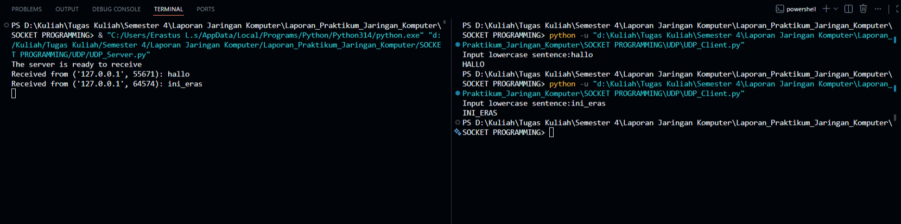
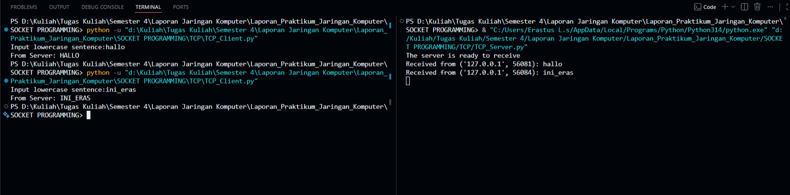

# Laporan Praktikum - Jaringan Komputer - Week 7
Modul 7: Socket Programming

## UDP Server
```` python
from socket import *

serverPort = 8070

serverSocket = socket(AF_INET, SOCK_DGRAM)

serverSocket.bind(('', serverPort))

print('The server is ready to receive')

running = True
while running:
	message, clientAddress = serverSocket.recvfrom(2048)
	decoded_message = message.decode()
	print(f"Received from {clientAddress}: {decoded_message}")
	if decoded_message.strip().upper() == "EXIT":
		serverSocket.sendto("Server shutting down...".encode(), clientAddress)
		running = False
		break
	modifiedMessage = decoded_message.upper()
	serverSocket.sendto(modifiedMessage.encode(), clientAddress)

serverSocket.close()
````
### Penjelasan:
* Import Modul Socket
  ```` python
  from socket import *
  ````
  Baris ini mengaktifkan pustaka (library) jaringan di Python. Tanpa ini, komputer tidak akan tahu apa itu IP, Port, atau Socket.
* Protokol Jaringan
  ```` python
  serverPort = 8070
  serverSocket = socket(AF_INET, SOCK_DGRAM)
  ````
  * serverPort = 8070: Menentukan "nomor pintu" rumah server. Port 8070 dipilih sebagai jalur masuk khusus untuk aplikasi ini.
  * socket(AF_INET, SOCK_DGRAM): Di sini kita menciptakan objek socket (semacam telepon genggam virtual).
    * AF_INET menginstruksikan socket untuk menggunakan keluarga alamat IPv4 (seperti 127.0.0.1 atau 192.168.1.1).
    * SOCK_DGRAM (Datagram Socket) menegaskan bahwa server ini menggunakan protokol UDP. Karakteristik UDP adalah cepat dan langsung kirim tanpa perlu proses handshake (berkenalan/koneksi) di awal seperti TCP.
* Mengunci Alamat Server (Binding)
  ```` python
  serverSocket.bind(('', serverPort))
  print('The server is ready to receive')
  ````
  * serverSocket.bind(...): Proses ini ibarat mendaftarkan nomor telepon ke jaringan agar bisa dihubungi. Server "mengikatkan" dirinya ke port 8070.
  * String kosong '' berarti server bersifat terbuka dan bersedia menerima kiriman data dari kartu jaringan (interface) mana pun yang ada di komputer tersebut (baik lewat Wi-Fi, kabel LAN, atau localhost).
  * print(...): Memberikan tanda di layar hitam (terminal) bahwa aplikasi server sudah aktif, berhasil mengunci port, dan siap bekerja.
  
* Siklus Hidup Server (The Main Loop)
  ```` python
  running = True
  while running:
  ````
  * running = True: Sebuah variabel kontrol (flag) untuk memantau status server. Selama nilainya True, server akan terus bekerja.
  * while running:: Membuat perulangan tanpa henti (infinite loop). Sebuah server pada umumnya harus selalu menyala 24 jam sehari untuk mengantisipasi data dari client yang bisa datang kapan saja secara mendadak.
* Menerima & Membaca Data Masuk
  ```` python
  message, clientAddress = serverSocket.recvfrom(2048)
	decoded_message = message.decode()
	print(f"Received from {clientAddress}: {decoded_message}")
  ````
  * serverSocket.recvfrom(2048): Ini adalah fungsi yang bersifat blocking (membuat program "berhenti" dan diam menunggu). Begitu ada paket data UDP yang masuk ke port 8070, fungsi ini akan terbangun dan menangkap dua informasi:
    * message: Data biner (mentah) isi pesan.
    * clientAddress: Alamat IP dan nomor port asal si client (penting dicatat agar server tahu ke mana harus mengirim balasan).
    * Angka 2048 adalah ukuran buffer maksima (2048 bytes) untuk menampung satu paket data.
  * message.decode(): Data yang mengalir di kabel jaringan berbentuk biner (bytes). Fungsi ini menerjemahkan kembali biner tersebut menjadi teks (string) huruf biasa agar bisa dibaca manusia dan diproses oleh Python.
  * print(...): Menampilkan log di terminal server, contohnya: Received from ('127.0.0.1', 54321): halo server.
* Mekanisme Mematikan Server (Mekanisme Exit)
  ```` python
  if decoded_message.strip().upper() == "EXIT":
		serverSocket.sendto("Server shutting down...".encode(), clientAddress)
		running = False
		break
  ````
  * if decoded_message.strip().upper() == "EXIT":: Ini adalah fitur keamanan/kontrol. Server memeriksa apakah client mengetik kata "exit".
    * .strip() membuang spasi atau enter yang tidak sengaja mengetik di ujung teks.
    * .upper() mengubah teks input menjadi huruf besar semua. Jadi, jika client mengetik "exit", "Exit", atau "ExIt", semuanya akan terdeteksi sebagai "EXIT".
  * serverSocket.sendto(...): Sebelum server mati, server mengirim pesan sopan terakhir ke client berupa teks "Server shutting down..." (yang diubah ke bentuk biner dengan .encode()).
  * running = False dan break: Mengubah kondisi perulangan dan menghentikan perulangan while secara paksa saat itu juga.
* Pemrosesan Data Normal & Pengiriman Balik
  ```` python
  modifiedMessage = decoded_message.upper()
	serverSocket.sendto(modifiedMessage.encode(), clientAddress)
  ````
  Bagian ini hanya dilewati jika pesan dari client bukan kata "EXIT"
  * decoded_message.upper(): Inti dari bisnis/tugas server ini: mengubah string teks biasa dari client menjadi huruf kapital semua.
  * serverSocket.sendto(...): Mengirimkan kembali teks yang sudah dikapitalisasi tersebut. Fungsi sendto pada UDP wajib menyertakan dua hal: data biner yang sudah di-.encode() dan alamat tujuan (clientAddress) yang didapatkan pada Bagian 4 tadi.
* Penutupan Jaringan
  ```` python
  serverSocket.close()
  ````
  serverSocket.close(): Baris terakhir ini berada di luar perulangan while. Ketika perulangan hancur karena perintah "EXIT", baris ini akan dieksekusi untuk menutup gerbang socket secara resmi dan melepaskan Port 8070 kembali ke sistem operasi komputer agar bisa digunakan oleh aplikasi lain di kemudian hari.

## UDP Client
```` python
from socket import *

serverName = ‘127.0.0.1’
serverPort = 8070

clientSocket = socket(AF_INET, SOCK_DGRAM)

message = input(‘Input lowercase sentence:’)

clientSocket.sendto(message.encode(), (serverName, serverPort))

modifiedMessage, serverAddress = clientSocket.recvfrom(2048)

print(modifiedMessage.decode())

clientSocket.close()
````
Ini adalah program untuk sebuah UDP Client (User Datagram Protocol). Kode ini digunakan untuk mengirimkan pesan teks ke sebuah server, lalu menerima kembali pesan yang sudah diubah oleh server tersebut.

### Penjelasan:
* Import Modul Socket
  ```` python
  from socket import *
  ````
  Baris ini mengimpor semua fungsi dan konstanta dari modul socket bawaan Python.
  
* Menentukan Alamat dan Port Server
  ```` python
  serverName = '127.0.0.1'
  serverPort = 8070
  ````
  * serverName = '127.0.0.1': Ini adalah alamat IP tujuan (Server). Angka 127.0.0.1 adalah IP localhost, yang berarti server tersebut berjalan di komputer yang sama dengan komputer yang menjalankan kode client ini.
  * serverPort = 8070 : Ini adalah nomor port spesifik yang digunakan server untuk "mendengarkan" (listening) pesan masuk. Angka 8070 di sini adalah port tiruan (bisa diganti port lain yang kosong).
* Membuat Socket Client
  ```` python
  clientSocket = socket(AF_INET, SOCK_DGRAM)
  ````
  * Baris ini membuat objek socket baru milik client dengan nama clientSocket
  * AF_INET: Menandakan bahwa jaringan yang digunakan menggunakan IPv4.
  * SOCK_DGRAM: Menandakan bahwa protokol transportasi yang digunakan adalah UDP (User Datagram Protocol). UDP bersifat connectionless (tidak perlu membuat koneksi persahabatan di awal seperti TCP, langsung kirim saja).
* Mengambil Input dari User
  ```` python
  message = input('Input lowercase sentence:')
  ````
  Program akan berhenti sejenak untuk meminta pengguna mengetikkan sesuatu (dalam hal ini diminta kalimat huruf kecil) di terminal, lalu menyimpannya ke dalam variabel message.
* Mengirim Pesan ke Server
  ```` python
  clientSocket.sendto(message.encode(), (serverName, serverPort))
  ````
  * message.encode(): Karena data yang dikirim lewat jaringan harus berbentuk biner (bytes), fungsi .encode() mengubah teks string biasa dari user menjadi bentuk bytes (defaultnya UTF-8).
  * sendto(..., (serverName, serverPort)): Fungsi khas UDP untuk mengirimkan data ke alamat dan port server tujuan yang sudah ditentukan di awal.
    
* Menerima Balasan dari Server
  ```` python
  modifiedMessage, serverAddress = clientSocket.recvfrom(2048)
  ````
  Baris ini membuat client menunggu sampai ada balasan masuk dari server.
  * recvfrom(2048): Angka 2048 adalah ukuran buffer (maksimal kapasitas data yang bisa diterima dalam satu waktu, yaitu 2048 bytes).
  * Output: Fungsi ini mengembalikan dua hal sekaligus:
    1. modifiedMessage: Isi pesan bytes yang dikirim balik oleh server.
    2. serverAddress: Alamat IP dan port si pengirim (server).
* Menampilkan Hasil ke Layar
  ```` python
  print(modifiedMessage.decode())
  ````
  modifiedMessage.decode(): Kebalikan dari .encode(), fungsi .decode() mengubah data biner (bytes) yang diterima dari server kembali menjadi teks string biasa agar bisa dibaca manusia. print(...): Menampilkan teks tersebut ke layar/terminal.
* Menutup Socket
  ```` python
  clientSocket.close()
  ````
  Menutup pintu komunikasi socket client. Ini adalah praktik pemrograman yang baik untuk membebaskan sumber daya jaringan di komputer setelah komunikasi selesai.

### Output UDP
<br> 

## TCP Server
  ```` python
  from socket import *

  serverPort = 8080
  
  serverSocket = socket(AF_INET, SOCK_STREAM)
  
  serverSocket.bind(('', serverPort))
  
  serverSocket.listen(1)
  
  print('The server is ready to receive')
  
  running = True
  while running:
  	connectionSocket, addr = serverSocket.accept()
  	sentence = connectionSocket.recv(1024).decode()
  	print(f"Received from {addr}: {sentence}")
  	if sentence.strip().upper() == "EXIT":
  		connectionSocket.send("Server shutting down...".encode())
  		connectionSocket.close()
  		running = False
  		break
  	capitalizedSentence = sentence.upper()
  	connectionSocket.send(capitalizedSentence.encode())
  	connectionSocket.close()
  
  serverSocket.close()
  ````
### Penjelasan:

* Import Modul Socket
  ```` python
  from socket import *
  ````
  Mengimpor modul jaringan Python.
* Pembuatan Socket Server
  ```` python
  serverPort = 8080
  serverSocket = socket(AF_INET, SOCK_STREAM)
  ````
  * serverPort = 8080: Menentukan bahwa server TCP ini akan berjalan pada port 8080.
  * socket(AF_INET, SOCK_STREAM): Membuat socket baru.
    * AF_INET: Menggunakan protokol jaringan IPv4.
    * SOCK_STREAM: Menandakan bahwa protokol transportasi yang digunakan adalah TCP (bukan SOCK_DGRAM milik UDP). TCP menjamin data sampai dengan utuh, berurutan, dan tanpa error.
* Binding dan Listening (Mendengar Koneksi)
  ```` python
  serverSocket.bind(('', serverPort))
  serverSocket.listen(1)
  print('The server is ready to receive')
  ````
  * serverSocket.bind(('', serverPort)): Mengikat (binding) socket server ke port 8080 agar tidak dipakai aplikasi lain. String kosong '' berarti server siap menerima koneksi dari IP mana pun.
  * serverSocket.listen(1): Perintah khusus TCP. Ini menyuruh server untuk mulai mendengarkan (listening) permintaan koneksi dari client. Angka 1 adalah ukuran antrean (backlog), artinya maksimal hanya ada 1 client yang boleh mengantre saat server sedang sibuk.
* Loop Utama dan Menerima Koneksi (Accept)
  ```` python
  running = True
  while running:
    connectionSocket, addr = serverSocket.accept()
  ````
  * while running:: Perulangan agar server terus berjalan menunggu client.
  * serverSocket.accept(): Fungsi krusial TCP yang bersifat blocking (menunggu sampai ada client yang masuk). Ketika ada client yang terhubung, fungsi ini membuka "pintu khusus" baru dan mengembalikan dua hal:
    1. connectionSocket: Objek socket baru yang didedikasikan khusus untuk mentransfer data dengan client tersebut.
    2. addr: Alamat IP dan port milik client yang terhubung.
* Menerima Data dari Client
  ```` python
  sentence = connectionSocket.recv(1024).decode()
  print(f"Received from {addr}: {sentence}")
  ````
  * connectionSocket.recv(1024): Membaca data yang dikirim oleh client melalui socket khusus tadi. Angka 1024 adalah ukuran buffer maksimal (1024 bytes).
  * .decode(): Mengubah data biner (bytes) dari jaringan menjadi teks string biasa.
  * Perhatikan bahwa pada TCP, kita menggunakan .recv() (bukan .recvfrom()), karena socket ini sudah terikat khusus dengan satu client, jadi kita tidak perlu mencari tahu lagi IP pengirimnya dari fungsi ini.
    
* Logika Penutup (Fitur EXIT)
  ```` python
  if sentence.strip().upper() == "EXIT":
        connectionSocket.send("Server shutting down...".encode())
        connectionSocket.close()
        running = False
        break
  ````
  Jika client mengirimkan pesan "EXIT":
  * connectionSocket.send(...): Server mengirim teks "Server shutting down..." (yang diubah ke biner lewat .encode()) ke client tersebut. Pada TCP, kita menggunakan .send() (bukan .sendto()) karena jalurnya sudah pasti.
  * connectionSocket.close(): Menutup jalur komunikasi khusus dengan client tersebut.
  * running = False dan break: Menghentikan perulangan while agar server mati.
* Memproses Data Normal dan Menutup Koneksi Client
  ```` python
  capitalizedSentence = sentence.upper()
  connectionSocket.send(capitalizedSentence.encode())
  connectionSocket.close()
  ````
  * sentence.upper(): Mengubah teks dari client menjadi huruf kapital semua.
  * connectionSocket.send(...): Mengirimkan kembali teks kapital tersebut ke client.
  * connectionSocket.close(): Sangat Penting! Setelah selesai melayani satu client, socket khusus (connectionSocket) harus ditutup agar sumber daya komputer dibebaskan kembali.
* Mematikan Jaringan Utama Server
  ```` python
  serverSocket.close()
  ````
  Ketika perulangan selesai (karena perintah EXIT), baris terakhir di luar loop ini akan dijalankan untuk menutup socket utama (serverSocket). Port 8080 kini dilepaskan dan server benar-benar mati.

## TCP Client
  ```
  from socket import *

  serverName = '127.0.0.1'
  serverPort = 8080
  
  clientSocket = socket(AF_INET, SOCK_STREAM)
  
  clientSocket.connect((serverName, serverPort))
  
  sentence = input('Input lowercase sentence:')
  
  clientSocket.send(sentence.encode())
  
  modifiedSentence = clientSocket.recv(2048)
  
  print('From Server:', modifiedSentence.decode())
  
  clientSocket.close()` python
  ````
### Penjelasan:
* Import Modul Socket
  ```` python
  from socket import *
  ````
   Mengimpor modul jaringan Python.

* Menentukan Alamat Tujuan (Server)
  ```` python
  serverName = '127.0.0.1'
  serverPort = 8080
  ````
  * serverName = '127.0.0.1': Menentukan IP target tempat server berada. 127.0.0.1 berarti localhost (komputer yang sama dengan yang menjalankan client ini).
  * serverPort = 8080: Menentukan gerbang/port target pada server. Angka ini wajib sama dengan port yang dibuka oleh TCP Server (8080) agar koneksi bisa tersambung.

* Membuat Socket Client (TCP)
  ```` python
  clientSocket = socket(AF_INET, SOCK_STREAM)
  ````
  * Membuat objek socket di sisi client dengan nama clientSocket.
  * AF_INET: Menandakan penggunaan jaringan berbasis IPv4.
  * SOCK_STREAM: Menandakan bahwa client ini menggunakan protokol TCP. Ini membedakannya dengan UDP (yang menggunakan SOCK_DGRAM).

* Membuka Koneksi (Handshake)
  ```` python
  clientSocket.connect((serverName, serverPort))
  ````
  * Baris ini adalah ciri khas utama TCP. Client secara aktif menghubungi server di IP 127.0.0.1 port 8080 untuk melakukan proses three-way handshake (membangun koneksi resmi).
  * Program akan error di baris ini jika aplikasi server belum dinyalakan atau port-nya salah.
  
* Mengambil Input dari Pengguna
  ```` python
  sentence = input('Input lowercase sentence:')
  ````
  Program berhenti sejenak untuk meminta kamu mengetikkan kalimat di terminal (disarankan huruf kecil), lalu menyimpannya ke dalam variabel sentence.
* Mengirim Data ke Server
  ```` python
  clientSocket.send(sentence.encode())
  ````
  * sentence.encode(): Mengubah teks string dari input pengguna menjadi bentuk biner (bytes), karena jaringan hanya mengerti data biner.
  * .send(): Mengirimkan data tersebut langsung melalui jalur koneksi TCP yang sudah terbentuk. Kita tidak perlu menuliskan alamat IP dan Port lagi di dalam fungsi ini karena socket-nya sudah otomatis terhubung ke server sejak proses .connect() tadi.

* Menerima Balasan dari Server
  ```` python
  modifiedSentence = clientSocket.recv(2048)
  ````
  * Client akan menunggu (diam) sampai server mengirimkan data balasan.
  * .recv(2048): Membaca data kiriman dari server dengan kapasitas buffer maksimal sebesar 2048 bytes. Hasilnya disimpan dalam variabel modifiedSentence (masih dalam bentuk biner/bytes).
* Menampilkan Hasil Terjemahan
  ```` python
  print('From Server:', modifiedSentence.decode())
  ````
  * modifiedSentence.decode(): Menerjemahkan kembali data biner yang diterima dari server menjadi teks string biasa agar bisa dibaca manusia.
  * print(...): Mencetak teks kapital hasil olahan server tersebut ke layar terminal kamu.
* Menutup Koneksi
  ```` python
  clientSocket.close()
  ````
  Memutus koneksi TCP secara resmi dan menutup socket client. Ini penting dilakukan untuk membersihkan dan membebaskan sumber daya jaringan di komputer setelah komunikasi selesai.

  ### Output TCP
  <br> 
