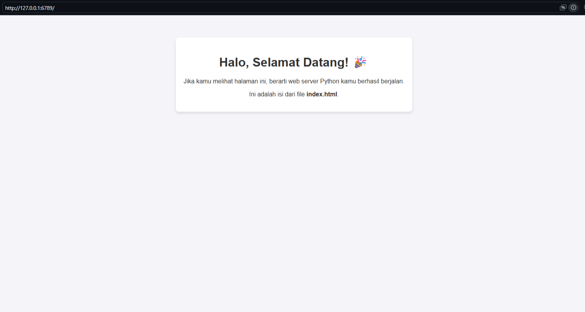
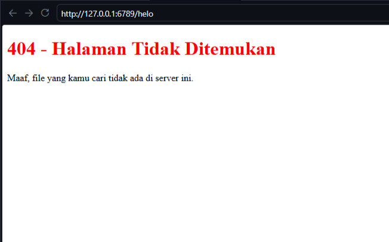

# Laporan Praktikum - Jaringan Komputer - Week 9
Modul 9: Web Server

## Code main.py
```` python
from socket import *
import sys
import os

serverSocket = socket(AF_INET, SOCK_STREAM)
serverSocket.setsockopt(SOL_SOCKET, SO_REUSEADDR, 1)
serverSocket.bind(('', 6789))
serverSocket.listen(1)

while True:
	print('Ready to serve...')
	print('Access on http://127.0.0.1:6789')
	connectionSocket, addr = serverSocket.accept()

	try:
		message = connectionSocket.recv(1024).decode()
		filename = message.split()[1]

		if filename == '/':
			filename = '/index.html'

		filepath = filename[1:]

		if not os.path.exists(filepath):
			filepath = '404.html'
			status = 'HTTP/1.1 404 Not Found\r\n'
		else:
			status = 'HTTP/1.1 200 OK\r\n'

		with open(filepath, 'r', encoding='utf-8') as f:
			outputdata = f.read()

		header = status + 'Content-Type: text/html\r\n\r\n'
		connectionSocket.send(header.encode())
		connectionSocket.send(outputdata.encode())

		connectionSocket.close()

	except Exception:
		connectionSocket.send('HTTP/1.1 500 Internal Server Error\r\n\r\n'.encode())
		connectionSocket.close()

serverSocket.close()
sys.exit()
````
### Penjelasan :
1. Impor Modul
   ```` python
   from socket import *
   import sys
   import os
   ````
   * from socket import *: Mengimpor semua fungsi dari modul socket untuk kebutuhan jaringan (membuat koneksi TCP/IP).
   * import sys: Mengimpor modul sistem untuk memanipulasi lingkungan runtime Python (seperti keluar dari program).
   * import os: Mengimpor modul OS untuk berinteraksi dengan sistem operasi, di sini digunakan untuk memeriksa apakah suatu file ada atau tidak di dalam folder.
2. Inisialisasi dan Konfigurasi Server Socket
   ```` python
   serverSocket = socket(AF_INET, SOCK_STREAM)
   serverSocket.setsockopt(SOL_SOCKET, SO_REUSEADDR, 1)
   serverSocket.bind(('', 6789))
   serverSocket.listen(1)
   ````
   * socket(AF_INET, SOCK_STREAM): Membuat socket baru. AF_INET berarti menggunakan protokol IPv4, dan SOCK_STREAM menandakan bahwa ini adalah koneksi TCP (andal dan berbasis koneksi).
   * setsockopt(SOL_SOCKET, SO_REUSEADDR, 1): Konfigurasi agar port yang digunakan bisa langsung dipakai kembali setelah server dimatikan. Tanpa ini, Anda sering kali harus menunggu beberapa menit sebelum bisa menjalankan server lagi di port yang sama.
   * bind(('', 6789)): Mengikat (binding) socket ke alamat IP dan nomor port. String kosong '' berarti server akan menerima koneksi dari semua antarmuka jaringan yang tersedia, dan 6789 adalah nomor port-nya.
   * listen(1): Menginstruksikan server untuk mulai mendengarkan koneksi yang masuk. Angka 1 adalah ukuran antrean (backlog), artinya server dapat menampung maksimal 1 koneksi yang mengantre saat server sedang sibuk.

3. Loop Utama dan Menerima Koneksi
   ```` python
   while True:
   print('Ready to serve...')
   print('Access on http://127.0.0.1:6789')
   connectionSocket, addr = serverSocket.accept()
   ````
   * while True:: Loop tak terbatas agar server terus berjalan dan selalu siap melayani permintaan baru secara bergantian.
   * serverSocket.accept(): Baris ini akan "memblokir" (menghentikan sementara) jalannya program sampai ada klien (seperti browser) yang terhubung. Begitu ada koneksi, fungsi ini mengembalikan dua hal:
     * connectionSocket: Socket baru khusus untuk berkomunikasi dengan klien tersebut.
     * addr: Alamat IP dan port milik klien.
4. Membaca Permintaan Klien (HTTP Request)
   ```` python
   try:
     message = connectionSocket.recv(1024).decode()
     filename = message.split()[1]
   ````
   * try:: Memulai blok penanganan error agar jika terjadi masalah saat melayani satu klien, server tidak langsung mati total.
   * connectionSocket.recv(1024).decode(): Membaca data permintaan HTTP dari klien sebesar maksimal 1024 byte, lalu mengubahnya (decode) dari bentuk bytes menjadi teks biasa (string).
   * message.split()[1]: Permintaan HTTP biasanya berbentuk teks seperti GET /index.html HTTP/1.1. Dengan melakukan .split(), teks tersebut dipecah berdasarkan spasi. Indeks [1] diambil untuk mendapatkan nama file yang diminta (misalnya: /index.html).

5. Penanganan Jalur File (Routing)
   ```` python
   if filename == '/':
     filename = '/index.html'

   filepath = filename[1:]
   ````
   * if filename == '/':: Jika pengguna hanya mengakses halaman utama (misal http://127.0.0.1:6789/), maka server secara otomatis akan mengarahkannya untuk membuka file /index.html.
   * filepath = filename[1:]: Menghilangkan karakter garis miring / di awal nama file (misal /index.html menjadi index.html) agar Python bisa mencarinya sebagai file lokal di dalam folder yang sama dengan skrip ini.

6. Pengecekan File dan Pengiriman Respon
   ```` python
   if not os.path.exists(filepath):
     filepath = '404.html'
     status = 'HTTP/1.1 404 Not Found\r\n'
   else:
     status = 'HTTP/1.1 200 OK\r\n'

   with open(filepath, 'r', encoding='utf-8') as f:
     outputdata = f.read()

   header = status + 'Content-Type: text/html\r\n\r\n'
   connectionSocket.send(header.encode())
   connectionSocket.send(outputdata.encode())
   
   connectionSocket.close()
   ````
   * os.path.exists(filepath): Memeriksa apakah file tersebut ada di folder.
     * Jika tidak ada, jalur file dialihkan ke 404.html dan status HTTP disetel ke 404 Not Found.
     * Jika ada, status HTTP disetel ke 200 OK.
   * with open(...): Membuka dan membaca seluruh isi file HTML tersebut ke dalam variabel outputdata.
   * header = ...: Menyusun HTTP Response Header. Karakter \r\n\r\n (dua kali baris baru) adalah aturan wajib dalam protokol HTTP untuk memisahkan antara bagian header dan bagian isi (body/content).
   * connectionSocket.send(...): Mengirimkan data header dan isi file HTML ke browser klien. Data harus diubah kembali menjadi bytes menggunakan .encode().
   * connectionSocket.close(): Menutup socket koneksi setelah selesai mengirim data ke klien tersebut.
7. Penanganan Error (Exception Handling) & Penutupan
   ```` python
      except Exception:
        connectionSocket.send('HTTP/1.1 500 Internal Server Error\r\n\r\n'.encode())
        connectionSocket.close()

      serverSocket.close()
      sys.exit()
   ````
   * except Exception:: Jika terjadi error yang tidak terduga di dalam blok try (misalnya file 404.html ternyata juga tidak ditemukan), server akan mengirimkan status 500 Internal Server Error ke browser dan menutup koneksi klien tersebut agar server bisa lanjut melayani permintaan berikutnya.
   * serverSocket.close() dan sys.exit(): Kode ini berada di luar loop while True. Di dalam struktur kode saat ini, kedua baris ini sebenarnya tidak akan pernah dieksekusi (unreachable code) karena loop di atas berjalan selamanya, kecuali Anda memodifikasi loop tersebut atau menghentikan program secara paksa (misal dengan Ctrl+C).
  
### Output Program
<br> Jika ada, status HTTP disetel ke 200 OK 
<br> Jika tidak ada, jalur file dialihkan ke 404.html dan status HTTP disetel ke 404 Not Found 


